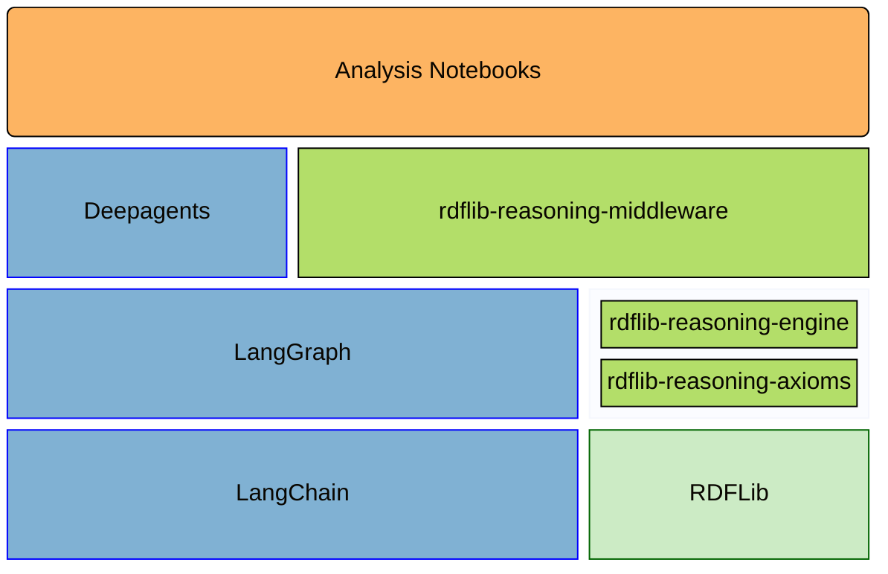

# rdflib-reasoning

[](https://opensource.org/licenses/MIT)
[](https://www.repostatus.org/#active)

[](https://pypi.org/project/rdflib-reasoning/)

[](https://github.com/kvjrhall/rdflib-reasoning/tree/python-coverage-comment-action-data)

`rdflib-reasoning` is the metapackage for a family of Python libraries used to study how tool-grounded Research Agents interact with RDF graphs and formal reasoning systems.
The source repository is organized as a multi-package workspace with supporting notebooks and development documentation.

The repository is organized around one practical research question:

> When do tool-grounded Research Agent harnesses outperform direct prompting on multi-step formal reasoning tasks that require external knowledge retrieval, knowledge-base updates, and verifiable inference?

## Reviewer Guide

If you are reviewing this repository quickly, start here:

1. Read this file for the repository layout and install paths.
2. Read [docs/dev/architecture.md](./docs/dev/architecture.md) for the current technical direction.
3. Inspect [rdflib-reasoning-engine](./rdflib-reasoning-engine/) for the reasoning core.
4. Inspect [rdflib-reasoning-middleware](./rdflib-reasoning-middleware/) for Research Agent integration.
5. Inspect [notebooks](./notebooks/) for the research surface and experiments.

## Repository Roles

This repository distinguishes between two agent types. Canonical definitions are in [AGENTS.md](./AGENTS.md).

- **Research Agent**: The deployed or runtime agent that is the subject of research. It sees middleware, tools, system prompts, and generated schema; it does not see the repository or design documentation.
- **Development Agent**: The code agent that reads repository documentation, modifies code and docs, and develops code for the Research Agent.

## Repository Layout

| Path | Purpose |
| --- | --- |
| [notebooks](./notebooks/) | Analysis notebooks and research experiments |
| [rdflib-reasoning-axioms](./rdflib-reasoning-axioms/) | Graph axiomatization primitives |
| [rdflib-reasoning-engine](./rdflib-reasoning-engine/) | RETE-based RDFS and OWL 2 RL entailment |
| [rdflib-reasoning-middleware](./rdflib-reasoning-middleware/) | Middleware and Research Agent-facing data interchange |
| [docs/dev](./docs/dev/) | Architecture notes, decision records, and development guidance |
| [docs/specs](./docs/specs/) | Cached specifications optimized for development work |

API and developer documentation can be generated locally with `make docs` and served from the
generated HTML output with `make docs-serve`.

## Quickstart

If you want to see the repository's RDFS inference capabilities quickly, start with these checked-in notebooks:

- [notebooks/demo-rdfs-inference.ipynb](./notebooks/demo-rdfs-inference.ipynb): shortest end-to-end walkthrough of RDFLib-backed RDFS materialization plus a proof view showing which rule applications justify one inferred triple
- [notebooks/demo-rdfs-retraction.ipynb](./notebooks/demo-rdfs-retraction.ipynb): update-aware companion showing that ordinary statement removal retracts dependent RDFS inferences
- [notebooks/demo-contradiction-rules.ipynb](./notebooks/demo-contradiction-rules.ipynb): OWL 2 RL contradiction diagnostics when contradiction rules are included in the active ruleset
- [notebooks/demo-proof-reconstructor.ipynb](./notebooks/demo-proof-reconstructor.ipynb): proof-focused companion notebook covering Mermaid rendering, markdown rendering, and raw `DirectProof` inspection
- [notebooks/README.md](./notebooks/README.md): notebook index with suggested reading order for demos and experiments

If you prefer a minimal code-first example before opening a notebook, the basic RDFS inference path looks like this:

```python
from rdflib import Dataset, Namespace
from rdflib.namespace import RDF, RDFS
from rdflib.plugins.stores.memory import Memory
from rdflib_reasoning.engine import PRODUCTION_RDFS_RULES, RETEEngineFactory
from rdflib_reasoning.engine.rete_store import RETEStore

EX = Namespace("urn:example:")

store = RETEStore(Memory(), RETEEngineFactory(rules=PRODUCTION_RDFS_RULES))
dataset = Dataset(store=store)
graph = dataset.default_graph

alice = EX.alice
person = EX.Person
mammal = EX.Mammal
animal = EX.Animal

graph.add((alice, RDF.type, person))
graph.add((person, RDFS.subClassOf, mammal))
graph.add((mammal, RDFS.subClassOf, animal))

assert (alice, RDF.type, animal) in graph
```

Because the reasoning store is wired through ordinary RDFLib graph events, statement
retraction uses the normal `graph.remove(...)` API:

```python
graph.remove((alice, RDF.type, person))

assert (alice, RDF.type, animal) not in graph
```

Contradiction detection is also available through the same engine path: include the
appropriate contradiction rules in `RETEEngineFactory(rules=...)`, and the default
recorder records the diagnostic before raising `ContradictionDetectedError`. The
contradiction notebook shows how to choose recorder policy and inspect the resulting
records.

## Component Overview

Research on agents takes place in [Analysis Notebooks](./notebooks/), uses the [LangChain ecosystem](https://www.langchain.com/), and depends on packages defined in this repository. Those packages build on [RDFLib](https://github.com/RDFLib/rdflib) for semantic-web support and on [Pydantic](https://docs.pydantic.dev/latest/) for Research Agent-friendly schemas.



## Installation

### Use the Published Packages

If you want to use the packaged system from another project, install the published metapackage:

```sh
pip install rdflib-reasoning
```

That install pulls in the repository's published component packages:

- `rdflib-reasoning`
- `rdflib-reasoning-axioms`
- `rdflib-reasoning-engine`
- `rdflib-reasoning-middleware`

If you only need part of the system, you can also install the component packages directly from PyPI.

### Work on This Repository Locally

Clone the repository and install the local workspace in editable mode:

```sh
pip install -e .
```

Add developer tooling:

```sh
pip install -e .[dev]
```

Add notebook and research dependencies:

```sh
pip install -e .[research]
```

Install the full local workspace:

```sh
pip install -e .[dev,research]
```

If you use `uv`, the equivalent commands are:

```sh
uv sync
uv sync --extra dev
uv sync --extra research
uv sync --extra dev --extra research
```

The root `Makefile` wraps those commands with `install`, `install-dev`, `install-research`, `install-all`, and `notebook`.

### Add or Review Research Notebooks

If you want to contribute notebooks to this repository, or inspect the notebooks that already exist, install the repository locally with the `research` extra and work from the [notebooks](./notebooks/) directory. The notebooks are part of the repository's research record rather than a separate published package.
For the current demo/tutorial entry points, see [notebooks/README.md](./notebooks/README.md).

### Develop Against These Packages Elsewhere

If you are building another system on top of this work, the usual path is:

1. Install the published packages from PyPI in your own project.
2. Read [docs/dev/architecture.md](./docs/dev/architecture.md) for the intended package boundaries.
3. Use the monorepo checkout only when you need to modify package code, contribute notebooks, or inspect unpublished changes.

## Why This Repository Exists

RDFLib does not by itself provide a clean path for graph axiomatization, Research Agent-oriented schema exposure, and inspectable reasoning workflows. This repository packages those concerns into reusable libraries and research notebooks so that formal-logic experiments with agents are easier to build, evaluate, and explain.
