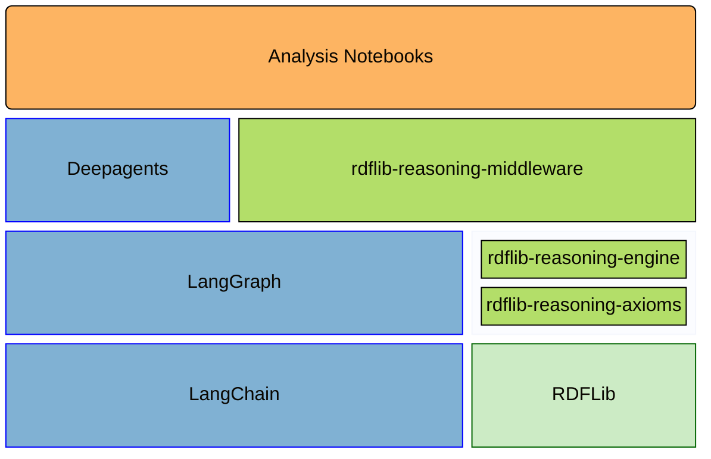

# rdflib-reasoning

[](https://opensource.org/licenses/MIT)
[](https://www.repostatus.org/#wip)

[](https://pypi.org/project/rdflib-reasoning/)


[](https://github.com/kvjrhall/rdflib-reasoning/tree/python-coverage-comment-action-data)

`rdflib-reasoning` is a monorepo for Python packages and notebooks used to study how tool-grounded Research Agents interact with RDF graphs and formal reasoning systems.

The repository is organized around one practical research question:

> When do tool-grounded Research Agent harnesses outperform direct prompting on multi-step formal reasoning tasks that require external knowledge retrieval, knowledge-base updates, and verifiable inference?

## Reviewer Guide

If you are reviewing this repository quickly, start here:

1. Read this file for the repository layout and install paths.
2. Read [docs/dev/architecture.md](./docs/dev/architecture.md) for the current technical direction.
3. Inspect [rdflib-reasoning-engine](./rdflib-reasoning-engine/) for the reasoning core.
4. Inspect [rdflib-reasoning-middleware](./rdflib-reasoning-middleware/) for Research Agent integration.
5. Inspect [notebooks](./notebooks/) for the research surface and experiments.

## Repository Roles

This repository distinguishes between two agent types. Canonical definitions are in [AGENTS.md](./AGENTS.md).

- **Research Agent**: The deployed or runtime agent that is the subject of research. It sees middleware, tools, system prompts, and generated schema; it does not see the repository or design documentation.
- **Development Agent**: The code agent that reads repository documentation, modifies code and docs, and develops code for the Research Agent.

## Repository Layout

| Path | Purpose |
| --- | --- |
| [notebooks](./notebooks/) | Analysis notebooks and research experiments |
| [rdflib-reasoning-axioms](./rdflib-reasoning-axioms/) | Graph axiomatization primitives |
| [rdflib-reasoning-engine](./rdflib-reasoning-engine/) | RETE-based RDFS and OWL 2 RL entailment |
| [rdflib-reasoning-middleware](./rdflib-reasoning-middleware/) | Middleware and Research Agent-facing data interchange |
| [docs/dev](./docs/dev/) | Architecture notes, decision records, and development guidance |
| [docs/specs](./docs/specs/) | Cached specifications optimized for development work |

API and developer documentation can be generated locally with `make docs` and served from the
generated HTML output with `make docs-serve`.

## Component Overview

Research on agents takes place in [Analysis Notebooks](./notebooks/), uses the [LangChain ecosystem](https://www.langchain.com/), and depends on packages defined in this repository. Those packages build on [RDFLib](https://github.com/RDFLib/rdflib) for semantic-web support and on [Pydantic](https://docs.pydantic.dev/latest/) for Research Agent-friendly schemas.



## Installation

Development in this repository is expected to use the `rdflib-reasoning` conda environment.

Base install:

```sh
pip install -e .
```

Developer tooling:

```sh
pip install -e .[dev]
```

Notebook and research tooling:

```sh
pip install -e .[research]
```

Full local workspace:

```sh
pip install -e .[dev,research]
```

If you use `uv`, the equivalent commands are:

```sh
uv sync
uv sync --extra dev
uv sync --extra research
uv sync --extra dev --extra research
```

The root `Makefile` wraps those commands with `install`, `install-dev`, `install-research`, `install-all`, and `notebook`.

## Why This Repository Exists

RDFLib does not by itself provide a clean path for graph axiomatization, Research Agent-oriented schema exposure, and inspectable reasoning workflows. This repository packages those concerns into reusable libraries and research notebooks so that formal-logic experiments with agents are easier to build, evaluate, and explain.
