# System Architecture

This repository's [high-level overview of system components](../../README.md#component-overview) is found in the root `README.md`.
In this document, we dive deeper into each component.

## How to use this document

- **Authoritative intended architecture**: This file is the single authoritative description of how the system *should* be structured and behave ("as it should be").
- **Decision records as history**: Decision records in `docs/dev/decision-records/` capture the rationale and history that led to this architecture. Do not infer the current architecture from a subset of decision records; always treat this document as the baseline.
- **Code as implementation**: The source code is the authority on how the system *currently* behaves ("as it is"). Where the code and this document disagree, that discrepancy represents design drift to be resolved by code changes, documentation changes, and/or new decision records.
- **Prospective use cases as planning input**: [prospective-use-cases.md](prospective-use-cases.md) records research-facing aspirations and long-horizon use cases. It MAY motivate architectural additions and roadmap sequencing, but it is not itself authoritative scope and MUST NOT override this architecture, the roadmap, decision records, or source code. This posture is recorded in [DR-029 Prospective Use Cases as Non-Authoritative Planning Input](decision-records/DR-029%20Prospective%20Use%20Cases%20as%20Non-Authoritative%20Planning%20Input.md).

## Agent roles

This repository distinguishes two agent types:

- **Research Agent**: A deployed or runtime agent that is the subject of or participant in research. It is implemented in code, sees tools and supplied system prompts, and may see generated schema of data classes exposed through middleware or MCP. It MUST NOT see repository content such as design docs, AGENTS.md, decision records, or source code.
- **Development Agent**: A code agent (e.g. Cursor, Claude Code) that accesses design documentation, module documentation, and repository content; modifies code and documentation; and develops code to support the Research Agent and documentation to support itself.

These definitions are summarized from and kept consistent with the root [AGENTS.md](../../AGENTS.md) and [DR-003 Research Agent and Development Agent Terminology](decision-records/DR-003%20Research%20Agent%20and%20Development%20Agent%20Terminology.md), which provide historical context and additional guidance.

## Structural elements and middleware

Structural elements describe OWL 2 and related graph-scoped constructs in a way that can be consumed both by middleware and by Research Agents via JSON-schema-driven tools and state.

- The `rdflib-reasoning-axioms` project defines a Pydantic model hierarchy:
  - `GraphBacked` is the universal base for graph-scoped Pydantic models.
  - `StructuralElement` is the universal base for OWL 2 structural element axiom heads and closely related extensions.
  - `StructuralFragment` is the sibling base for owned scaffolding (graph fragments co-essential to a single axiom's RDF mapping, such as the `rdf:List` carrying `owl:intersectionOf` members).
- Each instance has a single required `context` (graph identifier).
- The model hierarchy partitions references into three roles (DR-031):
  - `StructuralElement` axiom heads MUST NOT compose or aggregate other `StructuralElement` instances. Cross-axiom references MUST be expressed only through RDF node-level identity. Cross-axiom traversal is a graph-level helper concern, not an embedding concern.
  - `StructuralFragment` instances MAY be embedded as Pydantic fields on a single owning `StructuralElement`. The fragment's triples are part of the owner's partition; the fragment MUST share the owner's `context` (enforced by a centralized validator on `StructuralElement`).
  - Node references at the schema boundary MUST use the package-defined annotated RDF aliases (for example `N3IRIRef`, `N3Resource`, `N3Node`, `N3ContextIdentifier`) rather than raw rdflib node classes; raw rdflib node classes remain acceptable for internal non-schema logic. A node reference MAY be carried by a typed Pydantic wrapper (an authoring-layer `*Ref`) that decays to a bare node in `as_triples`; see "Composition layering" below.

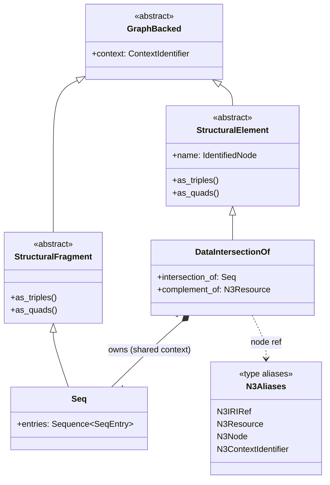

- A `StructuralElement.as_triples` MUST remain shallow with respect to other axiom heads: it MUST NOT recurse into other `StructuralElement` instances. Triples emitted by owned `StructuralFragment` fields legitimately appear in the owner's `as_triples` because they belong to the same partition. Structural elements expose `as_triples` and `as_quads` methods whose output conforms to the OWL 2 mapping to RDF and related RDF semantics specifications; `as_quads` appends `context` to each triple from `as_triples`.
- Cross-context relationships are expressed only at the triple/quad level.
- An axiom artifact (a `StructuralElement` plus any owned `StructuralFragment` fields) SHOULD correspond to the multiset (or set) of triples or quads actually present for that axiom's mapping, not to a closed subtree of interpreted axiom heads whose supporting triples may be missing elsewhere.
- Models avoid embedding heavy graph/session types (such as `rdflib.Graph` or SPARQL result objects).
- The `rdflib-reasoning-middleware` project uses `GraphBacked` (both `StructuralElement` and `StructuralFragment`) models as tool argument/response schemas and as values embedded in middleware state for Research Agents.

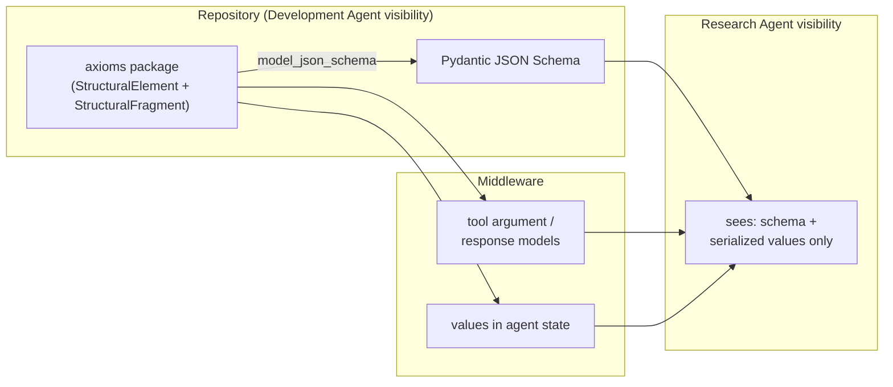

### Composition layering

The axioms package separates the **authoring layer** (agent-facing Pydantic schemas used to compose and interpret axioms) from the **persistence layer** (DR-031 partition-pure `StructuralElement` instances and their `as_triples` projections). The two layers are joined by a mechanical lowering operation and supported by bundle-level validation of operand declarations.

- **Authoring layer.** Operand fields MAY be typed as **operand references** (per-family Pydantic wrappers, working names `DataRangeRef`, `ClassExpressionRef`, `FacetRef`, and similar) carrying a `name: N3Resource` identity plus a `kind` discriminator. Operand fields MAY also be typed as discriminated authoring unions admitting either a `*Ref` or a nested `StructuralElement` body for inline composition.
- **Persistence layer.** Operands MUST be RDF node identities; `as_triples` MUST remain shallow with respect to other axiom heads per DR-031. The `*Ref` wrappers decay to bare nodes at the RDF and wire boundary; persistence-layer code MUST NOT depend on the `kind` field being present in the graph.
- **Lowering.** A `lower()` operation rewrites any authoring-layer artifact into a bundle of role-3-only `StructuralElement` instances plus their owned `StructuralFragment` fields. Nested operand bodies are minted as separate partitions; operand slots are rewritten to `*Ref` identities. `lower()` MUST preserve owned-fragment `context` invariants and MUST be idempotent.
- **Bundle validation.** Every operand identity in a bundle MUST either correspond to a `StructuralElement` declared in the same bundle or be explicitly marked as external by the authoring tool. Cross-bundle and graph-wide resolution remain graph-level helper concerns.
- **Where operand kind comes from on the wire.** Operand kind is carried by the OWL 2 `Declaration*` axioms already part of the OWL 2 RDF mapping. The authoring layer's `kind` discriminator is a schema-layer type witness, not an additional wire claim.

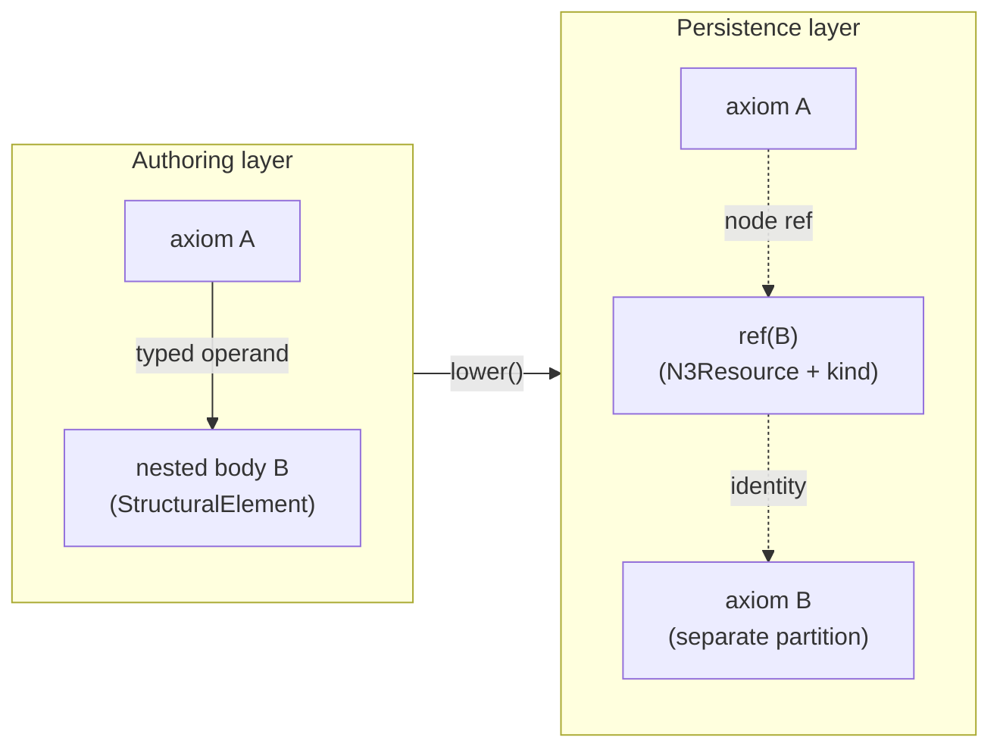

This layering preserves DR-031's persistence invariants while recovering compile-time operand-family discipline at the authoring boundary, so authoring agents and ML/persistence consumers can share a single underlying RDF representation. It is further elaborated in [DR-032 Authoring-Layer Composition and Persistence Lowering](decision-records/DR-032%20Authoring-Layer%20Composition%20and%20Persistence%20Lowering.md).

### Structural traversal and representation

Structural traversal is the inverse-facing companion to structural-element serialization.
Where `as_triples` and `as_quads` project a structural element into RDF, traversal lifts RDF graph content back into structural elements and related graph-backed objects.

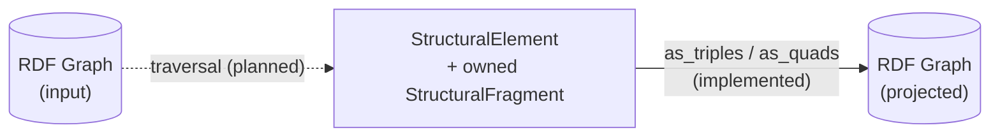

- Structural traversal SHOULD partition supported graph content into explicit `StructuralElement` or `GraphBacked` objects rather than forcing downstream agents to recover structural intent from raw triples alone.
- Traversal over OWL 2 content SHOULD use the local OWL 2 Mapping to RDF specification artifacts and crosswalks as the primary Development Agent-facing references.
- Traversal output SHOULD have a stable deterministic order so that graph-derived structural representations can be compared, rendered, embedded, and supplied to Research Agents repeatably.
- Structural rendering SHOULD be distinct from structural traversal. Rendering MAY produce prose, markdown, or other human-readable text from structural elements, but it MUST NOT change the canonical structured payload.
- Prose and text renderers SHOULD use RDFS labels, vocabulary metadata, CURIEs, and deterministic fallback identifiers so missing labels do not make output unstable.
- Traversal SHOULD work over RDF graphs containing asserted triples, inferred triples, or both. Inferred triples SHOULD be treated as ordinary graph content for traversal, while derivation, provenance, or proof links MAY be preserved separately when available.
- OWL structural traversal and OWL 2 RL inference SHOULD remain adjacent in roadmap planning. The system SHOULD avoid a design where inferred OWL-level facts cannot be lifted into structural representations that the rest of the repository can validate, render, or exchange.

### OWL system composition

The repository's OWL-related components are intended to compose rather than remain isolated features.

- OWL 2 Mapping to RDF support SHOULD connect structural element serialization, graph traversal, and validation.
- OWL 2 RL materialization SHOULD produce RDF graph output that can be consumed by structural traversal when the inferred triples correspond to supported structural constructs or assertions.
- Proof and explanation facilities SHOULD be able to refer to structural elements when that yields a more meaningful user-facing claim, while preserving triple-level proof support for derivations that do not naturally correspond to one structural element.
- OWL system integration SHOULD be demonstrated with graphs that include both asserted and inferred content, so architecture and tests exercise the asserted/inferred boundary explicitly.

### Schema-facing RDF boundary models

Schema-facing RDF boundary models are the Pydantic models and reusable schema aliases exposed by middleware across the runtime boundary to a Research Agent.
These models require stricter guidance than ordinary developer-only helper classes because their generated JSON Schema becomes part of the runtime contract.

- Boundary models MUST optimize for the Research Agent communication surface first. Their serialized form SHOULD be easy to inspect and SHOULD use lexical RDF forms such as N3 strings when those are the natural wire representation.
- Boundary models SHOULD keep RDF-specific validation rules close to the field or reusable type alias so the same constraints and descriptions are reused consistently across tools and state payloads.
- Boundary models SHOULD attach concise semantic descriptions, normative constraints, and a small number of high-fidelity lexical examples directly to the schema-visible field or reusable alias.
- Boundary models MAY cite formal specifications when that helps a Research Agent recover from validation errors, but schema descriptions SHOULD remain operational and brief rather than reproducing extended specification prose.
- Heavy runtime helper objects MAY exist as computed Python-only conveniences, but they MUST NOT be required serialized inputs or outputs across the Research Agent boundary.
- Module-level documentation for schema-facing boundary models SHOULD point Development Agents to the governing architecture section and decision record so local edits remain aligned with repository policy.

These rules are further elaborated in [DR-011 Schema-Facing RDF Boundary Models](decision-records/DR-011%20Schema-Facing%20RDF%20Boundary%20Models.md).

These rules are aligned with, and further elaborated in, [DR-031 Standalone Structural Elements](decision-records/DR-031%20Standalone%20Structural%20Elements.md).

## Middleware composition and capability gating

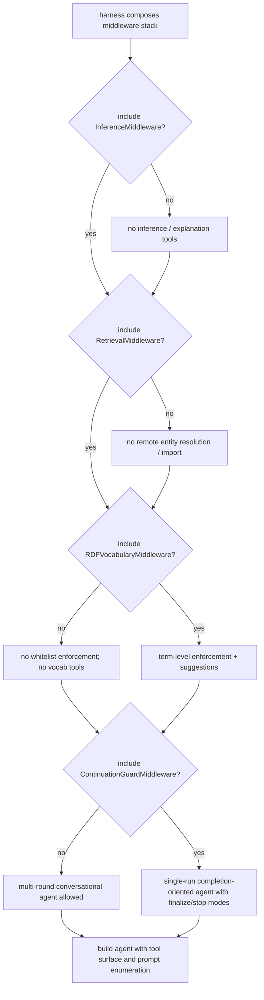

Middleware composition is the primary mechanism by which runtime capabilities are exposed to, or withheld from, a Research Agent.
This is an architectural constraint for both correctness and experimental control.

- Experimental conditions MUST be realizable by middleware composition alone. Baseline, retrieval-enabled, and inference-enabled conditions SHOULD differ by inclusion or exclusion of middleware capabilities, not by hidden prompt changes or ad hoc harness behavior.
- Inference capabilities MUST be enabled or disabled by inclusion or exclusion of inference middleware. A Research Agent without inference middleware MUST NOT be able to invoke inference or explanation behavior accidentally through some alternate path.
- Knowledge retrieval capabilities MUST be enabled or disabled by inclusion or exclusion of retrieval middleware. A Research Agent without retrieval middleware MUST NOT be able to access remote entity-resolution or remote import functionality accidentally through some alternate path.
- Knowledge retrieval middleware and inference middleware depend on dataset middleware because they operate on dataset-backed runtime state. If the concrete state shape or dataset-session abstraction changes, that dependency MUST remain explicit at the architectural level.
- Middleware that exposes capabilities to a Research Agent SHOULD do so through explicit tool/state surfaces with clear schemas rather than through hidden side effects.

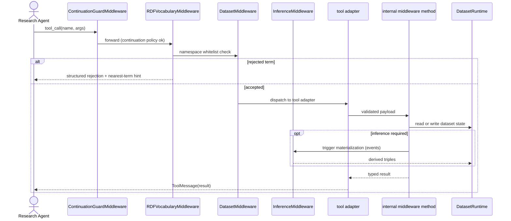

### Middleware stack layering and hook-role boundaries

Middleware composition SHOULD use an explicit layered order (outer to inner):

1. Deep Agents default middleware unless deliberately replaced for a specific
   experiment
2. LangChain prebuilt generic resilience middleware when needed (for example
   retry, fallback, context editing, and limits)
3. RDF capability middleware such as `DatasetMiddleware`,
   `RDFVocabularyMiddleware`, and `InferenceMiddleware`
4. RDF orchestration and policy middleware such as
   `ContinuationGuardMiddleware`
5. Provider-specific adapter middleware only when model-specific behavior
   requires it

Middleware hook ownership MUST remain explicit:

- Node hooks (`before_model` / `after_model`) MUST be used for state
  transitions, orchestration updates, and non-conflicting state writes.
- Wrap hooks (`wrap_model_call` / `awrap_model_call`) MUST own provider-bound
  request/response canonicalization, including transcript-shape normalization.
- Middleware SHOULD avoid node-hook transcript surgery via `RemoveMessage` when
  equivalent provider-bound request repair exists.

Reducer semantics are an architectural constraint:

- Middleware that updates `messages` MUST remain compatible with LangGraph
  `add_messages` reducer semantics.
- Reducer-fragile update patterns, including stale-delete paths that can target
  already-removed message ids, MUST be avoided.

Memory and skills integration SHOULD be staged:

- `MemoryMiddleware` and `SkillsMiddleware` SHOULD be introduced only after
  stack layering and hook-role boundaries are stable.
- Middleware state keys SHOULD remain concern-scoped (for example `rdf_*`,
  `continuation_*`, `memory_*`, `skills_*`) to avoid cross-concern coupling.

Packaging and adoption experiments are intentionally separate from core
semantic capability milestones:

- LangGraph skill packaging MAY be evaluated after repeated workflows have
  stable inputs, outputs, and success criteria.
- Subagent packaging MAY be evaluated for bounded workflows such as retrieval,
  axiom authoring, proof critique, or structural summarization.
- Skill and subagent packaging MUST be treated as experimental adoption tracks
  until concrete use cases show that they improve reliability, performance, or
  ergonomics.
- These packaging experiments are non-monotonic: evaluation MAY lead to
  adoption, partial adoption, deferral, or rejection without changing the core
  semantic architecture.

This posture is recorded in
[DR-030 Packaging Experiments as Post-Core Adoption Tracks](decision-records/DR-030%20Packaging%20Experiments%20as%20Post-Core%20Adoption%20Tracks.md).

Process adoption guidance:

- Middleware PR gates and rubric scoring SHOULD be used as advisory internal
  review guidance for now.
- These gates are intentionally not mandatory enforcement requirements for the
  current one-developer plus Development-Agent workflow.

### Dataset middleware

Dataset middleware is the foundational runtime layer for graph-backed experimentation.

- Dataset middleware is responsible for creating, loading, updating, serializing, and deleting RDF 1.1 graphs and datasets used by the Research Agent.
- Dataset middleware MUST treat the live RDFLib dataset as middleware-owned runtime infrastructure rather than as copied `AgentState` payload.
- Middleware state exposed to LangChain MUST remain `TypedDict`-compatible and cheap to copy. Live RDFLib datasets, stores, locks, and similar heavy runtime objects MUST NOT be stored directly in copied runtime state.
- Dataset middleware SHOULD resolve the active working dataset through a middleware-owned per-dataset session or equivalent internal container.
- Dataset middleware MAY expose a developer-facing `DatasetRuntime` service that owns the active dataset session and is used for explicit shared runtime injection.
- Each dataset session MUST own the live `rdflib.Dataset` together with the coordination primitive that protects it.
- Dataset middleware MUST provide multi-reader / single-writer coordination per dataset session so unrelated datasets do not block one another unnecessarily.
- Read-only dataset operations SHOULD execute under read coordination, and mutating dataset operations MUST execute under write coordination.
- Other middleware layers that retrieve knowledge or run inference MUST compose over dataset middleware rather than bypassing it.
- Retrieval and inference middleware that operate on the same dataset MUST use the same dataset-session coordination boundary as dataset tools, typically by sharing the same injected `DatasetRuntime`.
- Dataset middleware MUST NOT claim general transaction semantics for the baseline. Rollback, snapshot isolation, branch-local dataset copies, and conflict-merge semantics are explicitly out of scope unless later architecture extends the contract.
- RDF 1.2 triple-statement or quoted-triple support MAY be considered in the future, but it is not part of the current architectural baseline.

These rules are aligned with [DR-012 Middleware-Owned Dataset Sessions and Coordination](decision-records/DR-012%20Middleware-Owned%20Dataset%20Sessions%20and%20Coordination.md).

#### Dataset middleware capability phases

Dataset middleware capability MUST be introduced in phased slices rather than as a fully general dataset surface from the start.

1. Phase 1: Default-graph baseline
   - The initial public tool surface SHOULD focus on the default graph only.
   - The default Phase 1 tool set SHOULD be limited to listing triples, adding triples, removing triples, serializing current state, and resetting the dataset.
   - `0.2.0` dataset middleware scope is limited to this baseline.

2. Phase 2: Named-graph management and graph-scoped triple access
   - A later phase MAY add named graph creation, listing, and removal.
   - That same phase MAY extend triple-oriented tools with an optional graph or context argument while preserving the default graph as the default target.

3. Phase 3: Explicit dataset and quad operations
   - Generic quad-level CRUD and other explicitly dataset-wide manipulation SHOULD remain a later phase.
   - These operations SHOULD be added only when the agent or higher middleware layers have a demonstrated need for cross-graph manipulation that graph-scoped triple tools cannot express cleanly.

This phased structure is intended to preserve a narrow `0.2.0` baseline while keeping later dataset semantics available as explicit future scope.

#### Dataset middleware prompt and tool-description strategy

Dataset middleware SHOULD follow the same broad prompt-layering pattern used by middleware systems such as Deep Agents' built-in middleware, where middleware contributes capability-specific instructions and tool descriptions define the concrete callable surface.

- The middleware-level system prompt SHOULD introduce the capability in task-oriented language first, for example as a "knowledge base", while also identifying the implementation substrate as RDF when operational precision is needed.
- The middleware-level system prompt SHOULD explain when the agent ought to use dataset tools, how those tools fit together, and what high-level modeling constraints or safety expectations apply.
- The middleware-level system prompt SHOULD remain concise and SHOULD NOT duplicate detailed parameter-level guidance already present in tool descriptions or schema fields.
- Tool descriptions SHOULD remain operational and concrete: what the tool does, what scope it acts on, when to use it, and whether it is destructive.
- Schema-visible request and response models SHOULD carry field-level validation, lexical examples, and format guidance rather than pushing all such detail into prompt prose.
- Custom agent prompts or experiment prompts SHOULD complement middleware-added instructions rather than re-describing the middleware tool surface.

This strategy is informed by Deep Agents documentation describing middleware-appended prompts and tool-specific descriptions as complementary layers rather than one monolithic instruction block:

- [Deep Agents customization docs](https://docs.langchain.com/oss/python/deepagents/customization)
- [Deep Agents repository overview](https://github.com/langchain-ai/deepagents)
- [FilesystemMiddleware reference](https://reference.langchain.com/python/deepagents/middleware/filesystem/FilesystemMiddleware)

#### Research Agent tracing and observability

Runtime tracing in `rdflib-reasoning-middleware` MUST distinguish between raw
callback capture and correlated turn-level trace artifacts.

- Raw callback events such as `TraceEvent` emitted through `TraceRecorder` and
  stored in `TraceSink` MUST remain available as the low-level debugging
  substrate.
- Correlated turn-level artifacts such as `TurnTrace` MUST be derived from raw
  events rather than replacing them.
- The correlated tracing layer SHOULD preserve enough context to explain what
  the Research Agent emitted, which tool calls it requested, what tool
  results or `ToolMessage` payloads it observed, and how the turn ended.
- Renderers and other downstream consumers SHOULD depend on correlated turn
  artifacts rather than reimplementing event grouping and tool-correlation
  logic themselves.
- Raw events MAY still be consumed directly by tests, low-level debugging
  tools, or future alternate renderers when that level of detail is needed.

These rules are aligned with [DR-015 Correlated Turn Tracing over Raw Callback Events](decision-records/DR-015%20Correlated%20Turn%20Tracing%20over%20Raw%20Callback%20Events.md).

#### Continuation guard middleware

Continuation guards are optional orchestration-control middleware for
single-run, completion-oriented Research Agent harnesses.

- Continuation guard middleware MUST model continuation control as a small
  private runtime state machine rather than as reminder-only prompt text.
- The conceptual continuation-control modes are:
  - `normal`: ordinary single-run behavior
  - `finalize_only`: the next acceptable step is finalization or a specific
    corrective dataset change
  - `stop_now`: the run MUST terminate deterministically
- Continuation guard middleware MAY re-prompt when the Research Agent has
  clearly stopped in an unfinished mode, but provider-safe continuation MUST
  use injected `HumanMessage` prompts rather than relying on implicit
  continuation from an assistant-final transcript.
- Provider-safe continuation MUST be role-aware: middleware SHOULD inject a
  `HumanMessage` reminder only when that transition is valid for the current
  transcript shape, and SHOULD NOT force a `tool -> user` transition.
- Once the latest assistant output contains a valid completed Turtle answer,
  continuation guard middleware SHOULD terminate the run deterministically
  rather than allowing further model continuation.
- Middleware that owns a strong continuation trigger, such as repeated
  unchanged serialization rejection, SHOULD emit an explicit state transition
  into `finalize_only` rather than relying on the Research Agent to infer the
  correct control branch from prose alone.
- Continuation guard middleware is distinct from capability middleware such as
  dataset or vocabulary middleware and MUST NOT be used to hide or replace
  capability boundaries.
- Continuation guard middleware SHOULD be used when a harness expects the
  Research Agent to continue acting until a completed answer or next tool call.
- Continuation guard middleware SHOULD NOT be implied by default for
  deliberately multi-round conversational or memory-backed agent setups where a
  planning-only turn may be acceptable.
- Model-specific prompt adaptation middleware SHOULD remain separate from
  continuation discipline middleware.

These rules are aligned with [DR-020 Middleware Stack Layering and Hook-Role Boundaries](decision-records/DR-020%20Middleware%20Stack%20Layering%20and%20Hook-Role%20Boundaries.md).

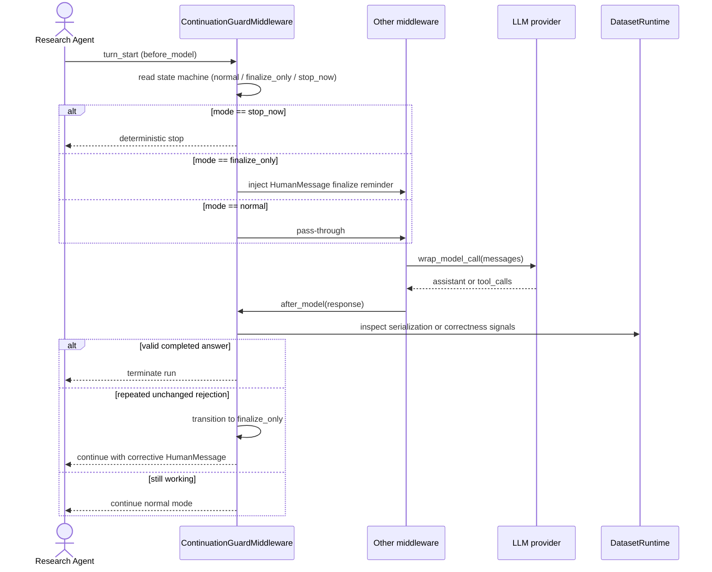

#### Dataset middleware internal methods and tool adapters

Dataset middleware MUST maintain a clear separation between internal implementation methods and Research Agent-facing tool adapters.

- Internal middleware methods SHOULD implement the core RDFLib-native behavior and SHOULD be the source of truth for dataset operations.
- Tool implementations SHOULD remain thin adapters whenever possible.
- Thin adapters SHOULD validate or transform request payloads, delegate to internal middleware methods, and transform results into response payloads.
- Retrieval middleware, inference middleware, and tests SHOULD prefer composing with internal middleware methods rather than simulating agent tool calls when no schema-boundary behavior is under test.
- Tool adapters MUST NOT duplicate core implementation logic except for minimal glue required by the orchestration framework.

These rules are aligned with [DR-013 Dataset Middleware Internal Method and Tool Adapter Pattern](decision-records/DR-013%20Dataset%20Middleware%20Internal%20Method%20and%20Tool%20Adapter%20Pattern.md).

#### Shared middleware services

Middleware MAY compose over explicit shared services when multiple middleware
components need coordinated access to the same runtime state, policy, or
telemetry.

- Shared middleware services MUST be injected explicitly through constructors or
  configuration objects.
- Middleware MUST NOT discover sibling middleware instances implicitly and MUST
  NOT rely on middleware composition order as a hidden service-sharing
  mechanism.
- `DatasetRuntime` is the shared mutable coordination boundary for middleware
  that operate on the same live RDF dataset.
- Shared services that do not require dataset mutation, such as vocabulary
  policy or run-local telemetry, SHOULD remain separate from `DatasetRuntime`
  rather than broadening the dataset session into a monolithic coordination
  object.
- Run-local telemetry such as asserted term-usage counts MAY be recorded by one
  middleware and consumed by another, but that sharing MUST remain explicit and
  capability-scoped.
- Vocabulary setup SHOULD use a two-step pattern:
  - `VocabularyConfiguration` as declarative input
  - `VocabularyContext` as validated cached runtime state
- Middleware that needs vocabulary policy or indexed vocabulary visibility
  SHOULD consume one shared `VocabularyContext` rather than separately injected
  whitelist and cache objects.

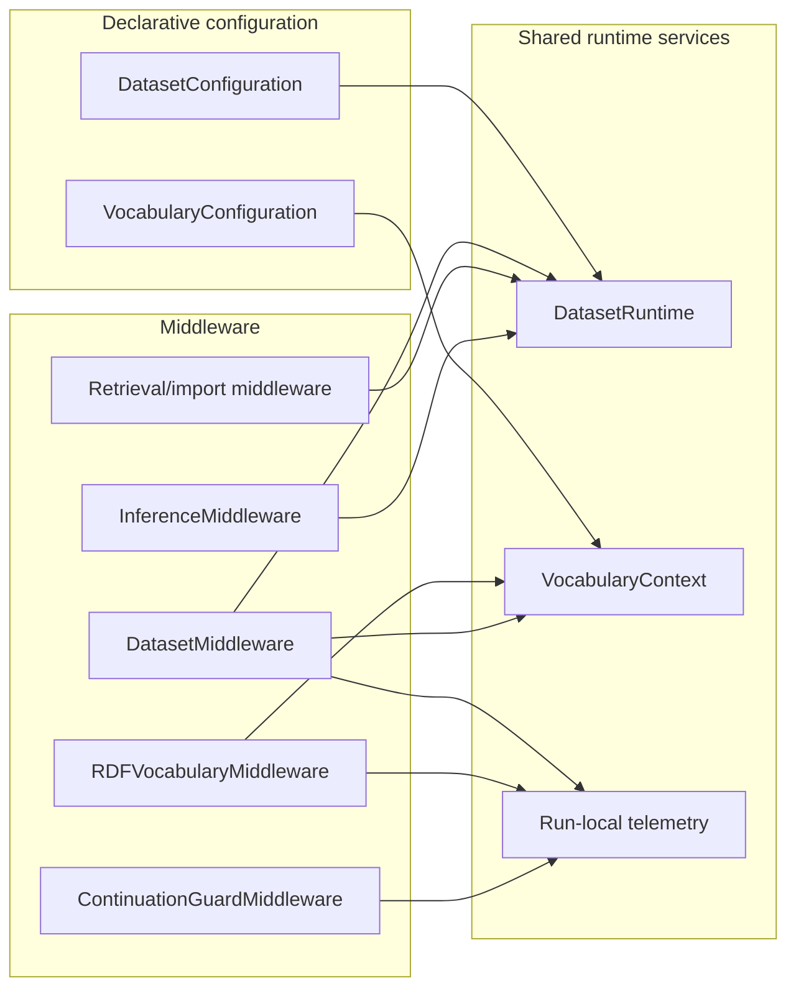

These rules are aligned with [DR-020 Middleware Stack Layering and Hook-Role Boundaries](decision-records/DR-020%20Middleware%20Stack%20Layering%20and%20Hook-Role%20Boundaries.md).

#### Namespace whitelisting

Namespace whitelisting is a shared vocabulary-policy mechanism that constrains
which namespace prefixes — and, for closed vocabularies, which specific terms —
the Research Agent may use.

- Namespace whitelisting MUST be explicit through `VocabularyContext`; there is
  no ambient default middleware path that bypasses it.
- When whitelisting is enabled, it MUST provide three affordances:
  1. **Enforcement**: `add_triples` MUST reject URIs whose namespace is not among the allowed vocabularies. For closed vocabularies (rdflib `DefinedNamespace` subclasses), enforcement MUST include term-level membership testing. For open vocabularies (rdflib `Namespace` instances), enforcement MUST be limited to namespace-prefix matching.
     `list_terms` and `inspect_term` in vocabulary middleware MAY also enforce the same injected whitelist when present.
  2. **Enumeration**: The middleware-appended system prompt MUST include a structured enumeration of the allowed vocabularies. A corresponding tool-agnostic extraction of this enumeration SHOULD be maintained for baseline prompt-asymmetry reduction, following the `DATASET_TIPS` / `VOCABULARY_TIPS` pattern.
  3. **Remediation**: For closed vocabularies, the middleware SHOULD use Levenshtein distance (or equivalent string-similarity metric) to suggest the nearest valid term when a rejected URI names a non-existent term in a whitelisted closed namespace.
- Whitelisting MUST distinguish open and closed vocabularies through rdflib's `Namespace` / `DefinedNamespace` type hierarchy. This distinction determines whether enforcement operates at the prefix level or the term level.
- The same whitelist type SHOULD be shareable between dataset middleware and
  vocabulary middleware.
- The whitelisting configuration SHOULD be derived from
  `VocabularyConfiguration` and carried at runtime through `VocabularyContext`.
- Public middleware setup SHOULD take `VocabularyContext` through middleware
  config objects rather than accepting raw whitelist/cache wiring.

These rules are aligned with [DR-014 Namespace Whitelisting for Dataset Middleware](decision-records/DR-014%20Namespace%20Whitelisting%20for%20Dataset%20Middleware.md) and [DR-020 Middleware Stack Layering and Hook-Role Boundaries](decision-records/DR-020%20Middleware%20Stack%20Layering%20and%20Hook-Role%20Boundaries.md).

### RDF vocabulary middleware

RDF vocabulary middleware provides indexed vocabulary retrieval and inspection to
the Research Agent through a dedicated tool surface. It is architecturally
distinct from knowledge retrieval middleware: vocabulary middleware exposes
pre-indexed, locally-bundled vocabulary definitions for term discovery and
validation, whereas knowledge retrieval middleware performs remote RDF import.

- Vocabulary middleware MUST compose alongside dataset middleware and MUST NOT
  mutate dataset state directly.
- Vocabulary middleware SHALL consume one injected `VocabularyContext` for
  vocabulary policy and indexed vocabulary visibility.
- Vocabulary middleware MAY also consume explicitly injected shared read-only
  services such as `RunTermTelemetry`.
- The indexed vocabulary set is backed by bundled specification files and
  extensible through `VocabularyDeclaration(user_spec=UserVocabularySource(...))`.
  Bundled and user-supplied vocabularies both flow through shared ontology
  metadata extraction and caching, but bundled vocabularies are visible only
  when declared into the `VocabularyContext`.
- The indexed vocabulary set SHOULD include at minimum the core Semantic Web vocabularies (RDF, RDFS, OWL, SKOS, PROV) and MAY expand to additional well-known vocabularies as bundled specification files become available.
- Vocabulary middleware SHOULD use VANN annotation properties such as
  `vann:preferredNamespacePrefix` and `vann:preferredNamespaceUri` as optional
  metadata enrichment for vocabulary summaries and namespace presentation when
  those annotations are present in an indexed vocabulary.
- VANN-derived metadata MAY improve labels, descriptions, prefix presentation,
  and later ranking signals, but it MUST NOT change which vocabularies are
  declared in `VocabularyContext` and MUST NOT weaken whitelist or vocabulary
  visibility policy.
- Vocabulary middleware MUST expose its capability through explicit tools: `list_vocabularies`, `list_terms`, `search_terms`, and `inspect_term`.
- `search_terms` SHOULD be the primary discovery path when the Research Agent knows the meaning it wants to express but does not yet know the correct indexed term.
- `inspect_term` SHOULD remain the confirmation path for semantically important candidates before use.
- `list_terms` and `list_vocabularies` SHOULD remain available for narrower or manual exploration, but they SHOULD NOT be the default search path for ordinary Research Agent term selection.
- `inspect_term` SHOULD provide a compact normalized description suitable for fast term selection and MAY include the term's native RDF description including transitive `rdfs:subClassOf` and `rdfs:subPropertyOf` paths when the Research Agent requests richer structural context.
- `search_terms` MAY use lexical, structural, and other ranking signals derived from the local indexed vocabulary set, but that ranking policy remains middleware-owned rather than a Research Agent responsibility.
- Vocabulary middleware SHOULD expose only the indexed vocabularies present in
  the injected `VocabularyContext` and SHOULD convert policy violations or
  unindexed-term lookups into tool-facing recoverable errors rather than raw
  exceptions.
- Vocabulary middleware SHOULD follow the same prompt-layering pattern as dataset middleware: a middleware-level system prompt introduces the capability and its tools, while tool descriptions and schema fields carry operational detail.
- Vocabulary middleware SHOULD discourage repeated unchanged inspection of immutable index results through both agent-facing guidance and middleware-owned misuse controls when the same query is retried without modification.
- Vocabulary middleware SHOULD present search-and-confirm behavior directly, rather than introducing an explicit frontier abstraction that the Research Agent must reason about.
- Vocabulary middleware capabilities MUST be enabled or disabled by inclusion or exclusion of the middleware. A Research Agent without vocabulary middleware MUST NOT be able to query the vocabulary index through some alternate path.

These rules are aligned with [DR-017 Search-First RDF Vocabulary Retrieval](decision-records/DR-017%20Search-First%20RDF%20Vocabulary%20Retrieval.md) and [DR-020 Middleware Stack Layering and Hook-Role Boundaries](decision-records/DR-020%20Middleware%20Stack%20Layering%20and%20Hook-Role%20Boundaries.md).

### Graph import, provenance, and knowledge retrieval

Graph import and provenance are core infrastructure for bringing structured
knowledge into dataset-backed state in an inspectable way.
Remote knowledge retrieval builds on that infrastructure, but it is a distinct
capability that MAY be scheduled later than the local graph-import and
provenance baseline.

Knowledge retrieval middleware is architecturally distinct from RDF vocabulary
middleware: retrieval middleware performs remote RDF import and entity
resolution, whereas vocabulary middleware exposes pre-indexed local vocabulary
definitions.

- Graph import SHOULD support loading RDF content into controlled graph or dataset contexts before remote provider-specific retrieval is required.
- Imported graph content SHOULD carry provenance sufficient to explain where facts originated, how they were imported, and which graph or dataset context owns them.
- Provenance SHOULD be modeled as a cross-cutting concern for graph import, knowledge exchange, proof evaluation, and memory-oriented use cases rather than as retrieval-only metadata.
- If provenance artifacts are intended to cross the runtime boundary as schema-driven values visible to the Research Agent, they SHOULD be modeled as `GraphBacked` structures rather than ad hoc dictionaries or transport-specific payloads.
- Retrieval middleware MAY support remote RDF retrieval from providers such as DBpedia and, later, Wikidata.
- Retrieval middleware MAY support extraction of structured site metadata such as embedded JSON-LD from HTML pages.
- Retrieval results SHOULD reuse the graph-import and provenance contracts rather than defining provider-specific import semantics.
- If entity resolution outputs are intended to cross the runtime boundary as schema-driven values visible to the Research Agent, they SHOULD be modeled as `GraphBacked` structures rather than ad hoc dictionaries or transport-specific payloads.
- The entity-resolution pipeline MAY be exposed either as a sequence of tools or as a dedicated subagent with a constrained prompt and structured output. The architectural requirement is that its inputs and outputs remain explicit, inspectable, and controllable for experiments.

### Knowledge exchange and axiom authoring

Knowledge exchange is the controlled movement between RDF graph content,
structural elements, prose, proof objects, and schema-driven payloads.

- Knowledge exchange SHOULD build on structural traversal and representation so
  graph content can be inspected as typed structural objects and deterministic
  text.
- Middleware MAY eventually expose axiom-authoring tools that let Research
  Agents create supported structural elements directly, validate them, and add
  their RDF projection to dataset-backed state.
- Axiom-authoring surfaces SHOULD preserve the same boundary discipline as
  dataset tools: schema-visible inputs, explicit validation, recoverable tool
  errors, and thin adapters over internal implementation methods.
- Common non-OWL patterns such as SKOS concepts or PROV derivations MAY receive
  graph-backed helper models when repeated use cases justify them, but such
  helpers MUST remain explicit extensions rather than implicit magic patterns.
- Knowledge exchange SHOULD preserve provenance, citations, trust metadata, or
  other quality signals when those signals are available in the source workflow.

### Inference middleware

Inference middleware is responsible for exposing reasoner-backed behavior to the Research Agent.

- Inference middleware MUST compose over dataset middleware so that inference operates on the same dataset-backed state as retrieval and manual graph updates.
- Inference execution, derivation tracing, and proof or explanation generation SHOULD be exposed as explicit runtime capabilities rather than being implicit side effects of unrelated operations.
- If derivations are exposed to the Research Agent, they SHOULD be available through a structured proof representation such as `DirectProof`, so that baseline and tool-enabled conditions can be compared against a common output schema.
- Middleware MAY reconstruct `DirectProof` values from engine-native derivation logs, agent-proposed proof content, or both, but the runtime boundary SHOULD expose a stable proof schema rather than raw engine internals.
- Middleware and callers SHOULD treat reconstructed proofs as a visibility-filtered view over derivation logs when silent derivations are present, rather than as a full dump of all engine-native derivation records.

### Engine event contract and entrypoint

The reasoning engine (e.g. RETE in `rdflib-reasoning-engine`) is driven by store events via `BatchDispatcher`.
This subsection codifies the contract and flow so that RETEStore and Development Agents have a clear foundation.

- **Store event contract:** Per [DR-026](decision-records/DR-026%20Store%20Event%20Ownership%20and%20BatchDispatcher%20Source%20Decoupling.md), `RETEStore` owns raw `TripleAddedEvent` and `TripleRemovedEvent` emission for every mutation it performs. `RETEStore.add`, `RETEStore.addN`, and `RETEStore.remove` emit one event per mutation on a private `_raw_dispatcher` BEFORE delegating to the backing store. `BatchDispatcher` subscribes to that private dispatcher rather than to the backing store's own dispatcher, so the backing store is treated as opaque persistence whose own event behavior is irrelevant to the engine. The batch dispatcher filters duplicate events by determining whether the triple is already in the store for that context using the standard `Store.contexts(triple)` API; that determination MUST use the store's own graph (or equivalent) for the context identifier, not the context object passed in the event (because `Store.add` passes the caller's context through unchanged, which may not be the store's graph). Only `rdflib.plugins.stores.memory.Memory` is validated as a backing store in this repository, but the engine no longer relies on its incidental `Store.add(self, ...)` call-up behavior; arbitrary context-aware backing stores are incidentally compatible.
- **Event flow:** RETEStore (add/addN/remove) → `_raw_dispatcher` → `TripleAddedEvent` / `TripleRemovedEvent` → BatchDispatcher → `TripleAddedBatchEvent` / `TripleRemovedBatchEvent` → inference engine → materialization (derived triples) → fixed-point iteration (handled by BatchDispatcher's loop).
- **Inference entrypoint:** The entrypoint for the inference engine is subscription to `TripleAddedBatchEvent` (and optionally `TripleRemovedBatchEvent`). Batches are per-context; the dispatcher iterates to fixed point. The tests in `rdflib-reasoning-engine/tests/test_batch_dispatcher.py` are the validated specification for this behavior.
- **Supported store integration path:** `RETEStore` is the intended store-facing adapter for the engine package. Development and debugging SHOULD treat `Store` events -> `BatchDispatcher` -> `RETEStore` -> `RETEEngine` as the single supported integration flow.
- **Persistence contract:** On open or attach, `RETEStore` MUST treat the current contents of the backing store as authoritative facts for each context. It MUST seed the engine from the fully materialized contents of that context; it MUST NOT attempt to reconstruct an asserted-versus-derived distinction from persisted RDF alone.
- **Warm-start contract:** Warm-start MUST proceed by creating the engine, executing zero-precondition bootstrap rules once for that engine-context initialization, reading the existing triples for the context from the backing store, warming the engine from those triples, and materializing any non-silent deductions attributable to that existing graph content back into the store. Bootstrap execution MAY repeat when the engine for a context is recreated (for example after reopen), but MUST be idempotent with respect to resulting logical state and materialized output policy. Triples produced solely during bootstrap and its bootstrap-only closure MUST remain engine-internal unless later source-graph input independently causes a non-silent materialization.
- **Engine update contract:** `RETEEngine.add_triples()` MUST be idempotent for already-known triples when derivation logging is disabled. `RETEEngine.add_triples()` and `RETEEngine.warmup()` MUST compute a fixed point for their input update set. `BatchDispatcher` provides store-level fixed-point iteration across reentrant materialization; it MUST NOT be relied upon to compensate for a partially saturating engine update step.
- **Implemented update and retraction baseline:** The current engine implementation preserves stable Fact identity, persistent alpha/beta memory, agenda-ordered execution, derivation logging, callback execution, and JTMS-compatible support bookkeeping for derived facts across add and remove flows. Development and debugging SHOULD treat recursive retraction and store/engine removal wiring as part of the implemented deductive dataset substrate, not as a future add-on.
- **Derivation logging contract:** If derivation logging is enabled, the engine MUST record rule applications in an engine-native structured form centered on grouped triple conclusions, supporting premises, a minimal rule identifier, and the context. Engine-native derivation logs MUST support arbitrary custom rules and MUST NOT require every derivation step to map one-to-one to a named OWL 2 structural axiom. Derivation records MUST preserve per-application visibility metadata such as effective `silent` state and bootstrap-phase occurrence so downstream reconstruction can enforce policy without losing raw provenance.
- **Silent visibility contract:** Rule-level silence MUST remain an immutable rule-definition property that defines default visibility during normal operation. Derivation records MUST carry the effective per-firing visibility in `DerivationRecord.silent`. Bootstrap-phase firings MAY therefore be recorded with `DerivationRecord.silent=True` even when `Rule.silent=False`, and `DerivationRecord.bootstrap=True` MUST distinguish that phase override from the rule's default policy. Silent rule applications MUST still be logged in derivation records when logging is enabled.
- **Profile-specific rule partitioning contract:** A production-oriented ruleset MAY split a canonical entailment pattern into multiple internal rules so visible and silent materialization policy can differ by term class or other guard conditions. When this is done, a conformant profile SHOULD preserve the canonical semantic rule identity used by specification-facing tests and documentation, while production-only split rule ids remain profile implementation details.
- **Explanation reconstruction contract:** Explanation reconstruction is distinct from derivation logging. The engine and related packages MAY reconstruct user-facing proof structures such as `DirectProof` from derivation logs, but `DirectProof` is not the engine's primitive execution format. Reconstructed proof steps MAY preserve grouped conclusions from a single rule application rather than fragmenting them into one proof node per output triple. Reconstructed user-facing proofs MUST exclude derivation records marked silent.
- **Proof metadata contract:** Engine-native derivation records SHOULD carry minimal rule identity such as a ruleset and rule id, while reconstructed proof steps SHOULD carry richer semantic metadata such as labels, descriptions, and authoritative URI-based references. Research Agent-authored proof steps MAY omit an engine-native rule identifier when only intended semantics are available.
- **Proof data model contract:** Proof and derivation models intended for interchange and evaluation SHOULD be immutable so they can be compared, cached, and reused safely across tooling.

These rules are aligned with [DR-004 RETE Store Persistence and Engine Update Contract](decision-records/DR-004%20RETE%20Store%20Persistence%20and%20Engine%20Update%20Contract.md), [DR-022 Bootstrap-Phase Effective Visibility and Derivation Metadata](decision-records/DR-022%20Bootstrap-Phase%20Effective%20Visibility%20and%20Derivation%20Metadata.md), and [DR-026 Store Event Ownership and BatchDispatcher Source Decoupling](decision-records/DR-026%20Store%20Event%20Ownership%20and%20BatchDispatcher%20Source%20Decoupling.md).

### Contradiction signaling

Contradiction handling is related to, but distinct from, inference execution and explanation behavior.

- Per [DR-027 Dual-Channel Contradiction Diagnostics and Explanation Contract](decision-records/DR-027%20Dual-Channel%20Contradiction%20Diagnostics%20and%20Explanation%20Contract.md), contradiction handling follows a dual-channel model: logical entailment remains triple-oriented engine-managed production, while contradiction outcomes are captured through a non-mutating diagnostics channel.
- Contradiction detection SHOULD cover the full currently modeled OWL 2 RL contradiction-producing `false` family (for example `eq-diff*`, `prp-irp`, `prp-asyp`, `prp-npa*`, `cls-nothing2`, `dt-not-type`) rather than relying only on `owl:Nothing` witness triples.
- Contradiction diagnostics MUST be queryable through a read-only API surface; they MUST NOT be represented as working-memory facts and MUST NOT mutate graph state.
- `?x rdf:type owl:Nothing` remains a valid contradiction witness shape, but it is not the only contradiction trigger.
- The behavior of the system after contradiction detection (for example `silent`, `warn`, or `error`) MUST be independently configurable from contradiction detection itself.
- Contradiction explanation SHOULD be reconstructed from contradiction diagnostics records and supporting premise/derivation context. It MUST NOT require materializing synthetic contradiction triples into logical closure.

```mermaid
sequenceDiagram
    participant Engine as RETEEngine
    participant Rule as OWL 2 RL false-rule (e.g. eq-diff1)
    participant Diag as ContradictionDiagnostics
    participant Caller as Inference middleware / API
    actor Agent as Research Agent

    Engine->>Rule: match terminal
    Rule-->>Engine: contradiction witness (premises, kind)
    Engine->>Diag: record(diagnostic_record)
    Note right of Engine: NO mutation of working memory; closure unaffected
    Caller->>Diag: query diagnostics(read-only)
    Diag-->>Caller: list of records
    alt policy = silent
        Caller-->>Agent: continue
    else policy = warn
        Caller-->>Agent: continue + structured warning
    else policy = error
        Caller-->>Agent: structured contradiction explanation
    end
```

## Proof evaluation harness

The repository SHOULD provide a reusable proof evaluation harness for baseline and follow-on experiments.
This harness is Development Agent evaluation infrastructure for assessing Research Agent outputs; it is not itself a capability that a Research Agent must see at runtime.

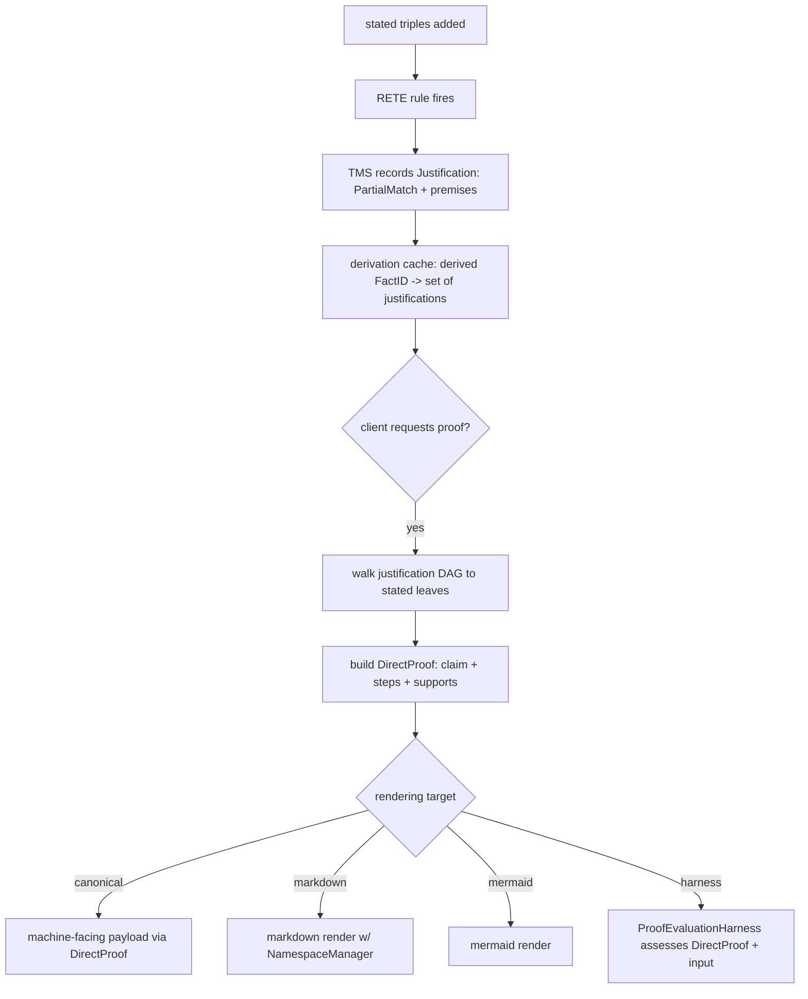

- The proof evaluation harness SHOULD live in `rdflib-reasoning-middleware`, because that package is the integration point between Research Agent-facing schemas, orchestration glue, and the reasoning packages.
- The proof evaluation harness MUST expose framework-agnostic structured inputs and outputs using Pydantic models so that notebooks, scripts, and multiple orchestration frameworks can consume the same contract.
- The proof evaluation harness MAY provide thin framework-specific adapters such as LangChain integration, but those adapters MUST remain secondary to the framework-agnostic data model and evaluation contract.
- The proof evaluation harness SHOULD begin with a single-pass structured assessment flow rather than a full planning agent. A multi-step Research Agent evaluator MAY be added later if experiments justify it.
- The proof evaluation harness SHOULD treat `DirectProof` as the common proof interchange format for baseline experiments, regardless of whether a proof originated from a Research Agent, a reconstructed engine derivation, or a hybrid of both.

### Proof evaluation harness inputs and outputs

The initial proof evaluation harness is intended to support a baseline notebook without requiring full axiomatization or a complete reasoning profile.

- Inputs SHOULD include an input document, a proposed `DirectProof`, and any task metadata needed to interpret the assessment.
- Outputs SHOULD include a typed assessment object whose fields can be consumed by notebooks and later batch experiments.
- The output schema SHOULD support both coarse verdicts and fine-grained error categories so that observed Research Agent mistakes can guide future feature prioritization.
- `DirectProof` SHOULD support proof payloads represented as graph-scoped Pydantic objects where that yields a natural typed claim or support, but it MUST also support triple-level claims directly because not every derivation step is most naturally represented as an OWL structural element.
- `DirectProof` SHOULD support proof steps whose conclusions are grouped when a single inference step naturally establishes multiple related outputs.

### Proof rendering

Proof rendering is distinct from proof reconstruction and proof interchange.

- Canonical proof structures such as `DirectProof` MUST remain machine-facing data models and MUST NOT be simplified in-place for presentation convenience.
- Rendering SHOULD be implemented as a separate presentation layer over canonical proof data.
- Rendering APIs MAY accept an RDFLib namespace source such as a `NamespaceManager`, graph, or dataset-derived equivalent in order to present compact names like `rdf:type` or `rdfs:subClassOf`.
- Namespace-aware shortening MUST be treated as presentation only. It MUST NOT replace the canonical RDFLib term content stored in the proof models.
- When no namespace source is available, renderers SHOULD fall back to a deterministic readable form rather than failing.
- Proof rendering MUST NOT be implemented by changing `__repr__` on proof models to use namespace-aware shortening. Debug-oriented representation and human-facing rendering SHOULD remain separate concerns.
- Notebook-friendly rendering is a desired future capability. Markdown-oriented rendering is RECOMMENDED as an initial target, and Mermaid-style structural rendering MAY be added later.

### Baseline scope

The baseline notebook SHOULD establish a narrow and defensible experiment.
It SHOULD avoid treating the first experiment as a complete test of all intended reasoning capabilities.

- The baseline SHOULD focus on whether a proposed `DirectProof` is acceptably grounded and structurally correct relative to the input document.
- The baseline SHOULD use the proof evaluation harness to produce structured assessments that can be analyzed after the fact.
- The baseline notebook SHOULD report conclusions based on actual harness outputs rather than attempting to pre-enumerate every current or future failure mode in its introduction.

### Initial proof evaluation dimensions

The proof evaluation harness feature matrix for the baseline SHOULD remain minimal.
Initial dimensions SHOULD be limited to those needed to run the first experiment and analyze common Research Agent errors.

- Groundedness of extracted entities and relationships
- Hallucinated entities or relationships
- Missing support required by the proposed proof
- Verdict on whether the proposed proof is acceptable for the baseline task
- Optional rationale and typed error labels

The following concerns are explicitly out of the initial baseline scope and SHOULD be added only when motivated by observed failures or a new experiment design:

- Complete set of proofs when multiple proofs exist
- Full contradiction detection and contradiction explanation
- Open World assumption handling for negative assertions
- Exhaustive completeness over all extractable entities and relations

## RETE Engine Design

### Overview

The engine MUST implement a forward-chaining **RETE-style** architecture with RETE-OO-inspired internals, specifically optimized for **OWL 2 RL** and **RDFS** entailment.
The design diverges from classic RETE by treating RDF triples as first-class objects and allowing Python extensibility, but the logical core MUST remain a pure RDF entailment engine.

- **Logical consequents** MUST be represented as declarative triple production handled by the engine itself.
- **Predicates / builtins** MAY use Python functions, but they MUST be read-only tests used during matching or internal evaluation.
- **Callbacks / hooks** MAY use Python functions for observability or integration, but they MUST NOT add triples, retract triples, or otherwise mutate graph state.
- **RDF data-model enforcement** MUST remain part of engine correctness, not just caller-side validation. The engine MUST refuse to admit or materialize triples that violate the RDF 1.1 triple constraints, especially literal subjects and non-IRI predicates.

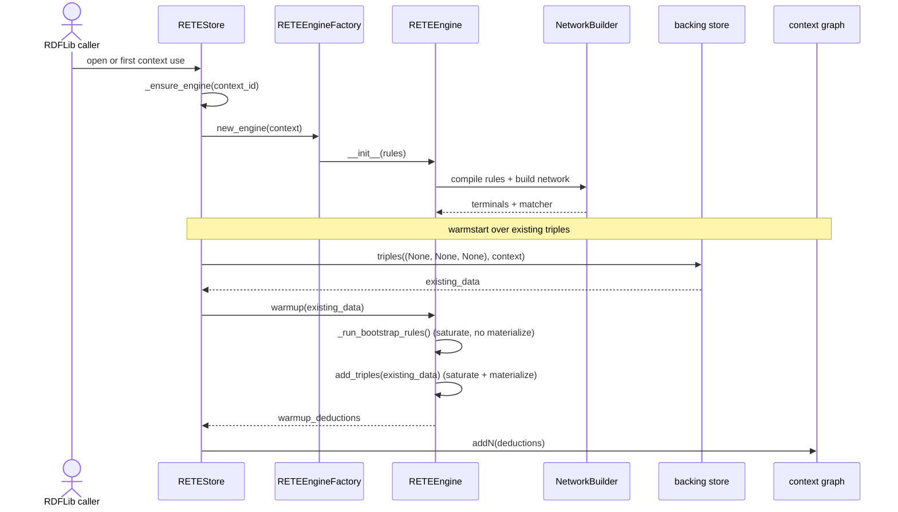

### Rule Matching & Network Topology

The engine SHOULD employ a **Left-Deep** join tree by default but MUST support **Structural Node Sharing** through a canonicalizing `NodeRegistry`.

- **Alpha Layer**: MUST support literal constraints (e.g., `Triple p == "rdf:type"`) and `PredicateNodes`. `PredicateNodes` SHOULD wrap duck-typed Python callables. To minimize interpreter overhead, the `NetworkBuilder` SHOULD position `PredicateNodes` after literal `AlphaNodes` but before `BetaNodes`.
- **Beta Layer**: MUST maintain memories of `PartialMatch` objects. The `JoinOptimizer` SHOULD use basic selectivity heuristics (e.g., specific properties are more selective than `rdf:type`) to order joins.
- **Terminal Layer**: Upon a full match, the engine MUST produce an engine-managed logical production and MAY additionally enqueue non-mutating callbacks.
- **Specialized relation indexes**: The architecture MAY later incorporate specialized relation indexes for selected reachability-oriented relations when that is more efficient than routing the same work exclusively through generic rule matching. Current intent is limited to schema-lattice relations such as `rdfs:subClassOf` and `rdfs:subPropertyOf`; concrete algorithms and integration boundaries remain future design work.

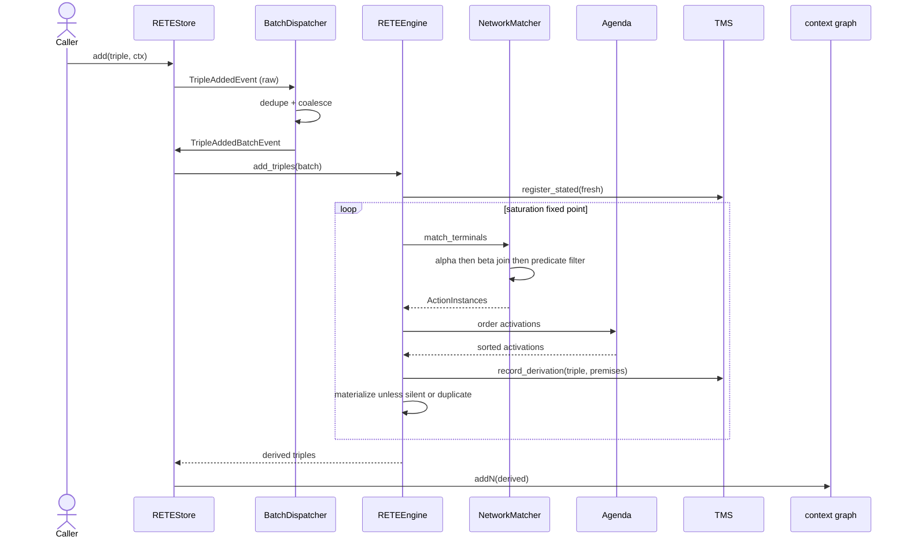

### Truth Maintenance System (TMS)

The engine MUST provide a **Justification-based Truth Maintenance System (JTMS)** to manage the deductive closure of the RDF graph.

- **Implemented support substrate:** The engine records support-compatible `Fact`, `PartialMatch`, and `Justification` data for stated and derived facts. These support objects are part of the live JTMS substrate used for proof reconstruction, support verification, and recursive retraction rather than disposable scaffolding.
- **Multi-Parent Support**: The `TMSController` MUST support multiple justifications for a single Fact. A Fact is considered logically supported if it has at least one valid `Justification` or is flagged as "Stated" (User-inserted).
- **Dependency Tracking**: Every `Justification` MUST capture a `PartialMatch` (as a tuple of FactIDs) to enable full **Derivation Tree** traversal. This is REQUIRED for both recursive retraction and generating human-readable explanations (e.g., Graphviz).
- **Recursive Retraction**: When a `Fact` is retracted, the `TMSController` MUST perform a **Mark-Verify-Sweep** operation. It MUST only retract downstream consequences if their `Justification` set becomes empty.
- **Support invariants**: A stated Fact MUST remain supported regardless of whether it also has zero, one, or many `Justification` records. A derived Fact MUST remain present if and only if it has at least one valid `Justification`.
- **Silent support semantics**: Silent status controls materialization and proof visibility only. It MUST NOT alter whether a derivation contributes support validity under JTMS invariants.
- **Removal propagation contract**: Low-level remove event forwarding MAY mirror add forwarding through `BatchDispatcher`, `RETEStore`, and `RETEEngine`, but logical removal MUST be governed by support validity rather than event arrival alone. A remove event MAY invalidate one support path without implying that the corresponding derived Fact is no longer present.
- **Staged implementation plan**: The intended Development Agent sequence is: (1) record support objects at production time for newly derived and already-known conclusions; (2) expose support verification APIs that can answer whether a Fact remains supported after one support path is invalidated; (3) implement recursive **Mark-Verify-Sweep** over the dependency graph; and only then (4) wire full triple removal through `RETEEngine`, `RETEStore`, and `BatchDispatcher`. All four stages are implemented. The support verification API surface is captured in [DR-023 JTMS Support Verification API Surface](decision-records/DR-023%20JTMS%20Support%20Verification%20API%20Surface.md), the recursive retraction primitive in [DR-024 TMSController Recursive Retraction](decision-records/DR-024%20TMSController%20Recursive%20Retraction.md), and the store/engine wiring with its re-materialization-with-warning policy in [DR-025 RETE Store Removal Wiring and Re-Materialization Policy](decision-records/DR-025%20RETE%20Store%20Removal%20Wiring%20and%20Re-Materialization%20Policy.md).

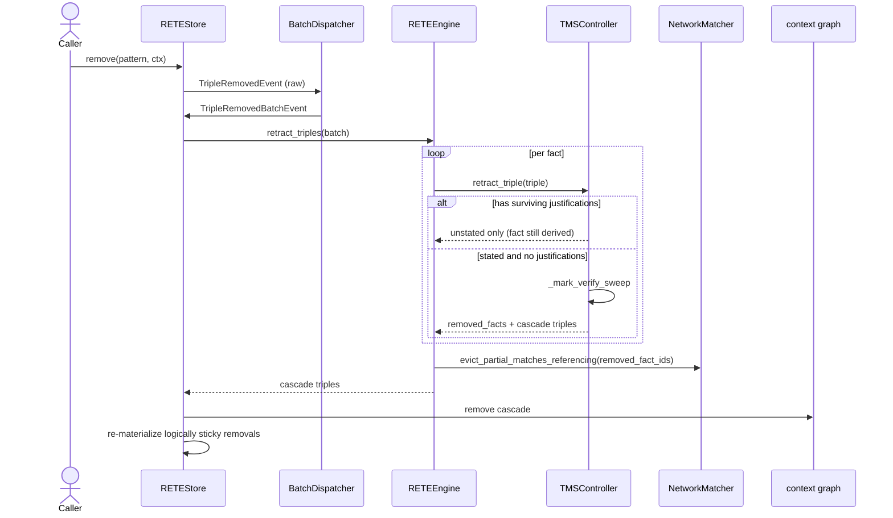

### Execution & Side Effects

Rule execution MUST be decoupled from matching via an `Agenda`.

- **Conflict Resolution**: The `Agenda` SHOULD prioritize execution based on **Salience** (user-defined) and **Inference Depth** (Breadth-First). Breadth-First execution is RECOMMENDED to ensure shorter derivation paths are found before complex property chains.
- **Logical Production Path**: Logical triple production MUST occur only through engine-managed rule heads. Python callbacks MUST NOT be an alternate inference channel or graph-mutation path.
- **Callbacks**: Callbacks MUST interact with the engine only through a read-only `RuleContext` or equivalent hook context. They MAY emit logs, metrics, traces, or other external signals, but they MUST NOT modify graph state.
- **Retraction Compatibility**: Because callbacks are non-logical and non-mutating, `RetractionNotImplemented` MUST be interpreted as meaning that no callback reversal is required for logical consistency. Logical triple removal is handled by the JTMS-backed retraction path described above, including support verification and recursive Mark-Verify-Sweep behavior.

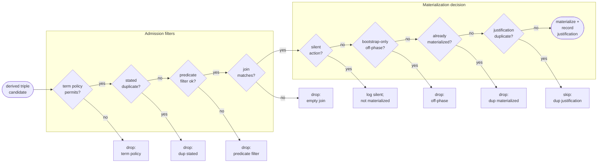

### RDF Data-Model Enforcement

The engine MUST enforce RDF 1.1 triple well-formedness for both stated inputs and inferred outputs.

- **Literal subjects**: The engine MUST NOT admit or materialize triples whose subject is a literal.
- **Predicate term constraints**: The engine MUST NOT admit or materialize triples whose predicate is not an IRI. Blank node predicates and literal predicates are explicitly disallowed.
- **Working-memory boundary**: Malformed triples MUST be filtered out before they enter working memory, support bookkeeping, or derivation outputs.
- **Policy surface**: The engine SHOULD expose configurable handling for malformed triples so that callers can choose fail-fast behavior or warning-and-skip behavior for experimental or migration scenarios.
- **Feature distinction**: This enforcement SHOULD be documented as a distinguishing engine feature because many RDF-oriented rule systems are more permissive about tuple-shaped inputs than this repository intends to be.

### Type Safety and Validation

The engine SHOULD utilize Python's `inspect` and `typing` modules at **Construction-Time** to validate rule signatures.

- Callback functions MUST accept `RuleContext` as the first argument.
- Subsequent callback arguments SHOULD be type-hinted as `Node` or `Fact` to facilitate "duck-typing" in the RETE network.

### Rationale

This hybrid approach balances the formal logic requirements of **OWL 2 RL** with the pragmatic need for procedural Python hooks. By separating declarative triple production from read-only predicates and non-mutating callbacks, the engine preserves deterministic fixed-point materialization while still supporting instrumentation and internal extensibility. By embedding the `PartialMatch` in the `Justification`, we ensure the engine is "Self-Explaining," while the `NodeRegistry` prevents the memory explosion typically associated with unoptimized RETE implementations.

These rules are aligned with [DR-005 RETE Consequent Partitioning and Retraction Compatibility](decision-records/DR-005%20RETE%20Consequent%20Partitioning%20and%20Retraction%20Compatibility.md).
Proof reconstruction and `DirectProof` layering are further aligned with [DR-007 Proof Model and Derivation Semantics Refinement](decision-records/DR-007%20Proof%20Model%20and%20Derivation%20Semantics%20Refinement.md), which supersedes [DR-006 Derivation Logging and DirectProof Reconstruction](decision-records/DR-006%20Derivation%20Logging%20and%20DirectProof%20Reconstruction.md).
Proof rendering and namespace-aware presentation are further aligned with [DR-008 Proof Rendering Separation and Namespace-Aware Presentation](decision-records/DR-008%20Proof%20Rendering%20Separation%20and%20Namespace-Aware%20Presentation.md).
Future specialized transitive handling intent is aligned with [DR-009 Transitive Relation Index Intent](decision-records/DR-009%20Transitive%20Relation%20Index%20Intent.md).
RDF triple well-formedness enforcement is aligned with [DR-010 RDF Triple Well-Formedness Enforcement](decision-records/DR-010%20RDF%20Triple%20Well-Formedness%20Enforcement.md).
