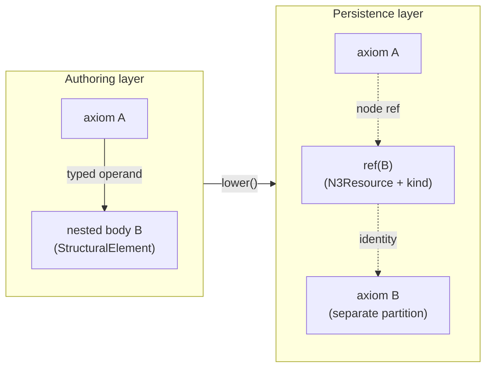
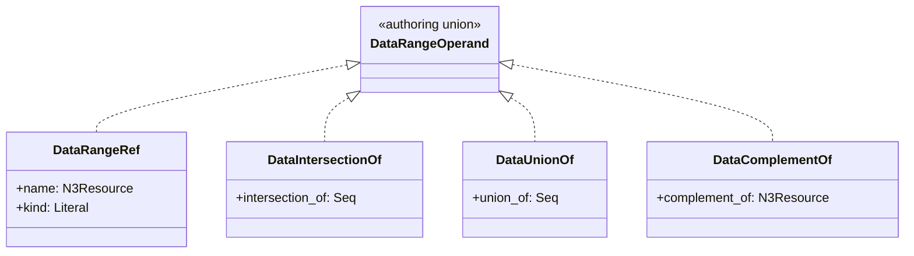
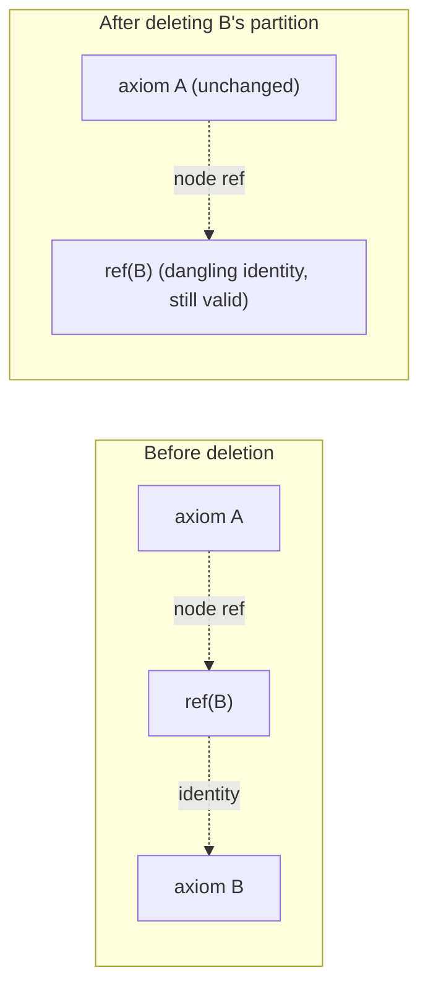

# Authoring-Layer Composition and Persistence Lowering

## Status

Accepted

## Context

The Pydantic class hierarchy under `GraphBacked` (DR-031) carries two distinct responsibilities that have not previously been separated:

1. **Agent composition and interpretation of OWL axioms.** Research Agents, authoring tools, and middleware consume axiom artifacts through generated JSON Schema. Typed operand fields let agents choose operand-family-appropriate values at composition time and let consumers narrow on operand kind without first dereferencing identities into the graph.
2. **ML training traversal of OWL axioms.** Partition-honest axiom chunks travel through ML pipelines as the unit of representation. Removing one partition MUST NOT leave a sibling partition still holding a closed subtree whose triples are no longer present.

Before [DR-031 Standalone Structural Elements](DR-031%20Standalone%20Structural%20Elements.md), the package attempted to give both responsibilities to the same class hierarchy. Operand-family disjointness was expressed at the axiom head's lineage (for example, `RestrictionFacet` and `DataRange` as ancestors of distinct operand families). When operand lists were parameterized as `Seq[T]`, that lineage produced a compile-time partitioning guarantee: an agent could not place a class-expression restriction node into an operand position typed `Seq[DataRange]`.

DR-031 constrained the persistence-facing surface: `StructuralElement` axiom heads MUST NOT compose other `StructuralElement` instances as Pydantic fields, `as_triples` MUST remain shallow with respect to other axiom heads, and cross-axiom references MUST be RDF node identifiers at the schema boundary. The structural-integrity benefit is substantial: chunk shape no longer depends on sibling axioms being present, and removing one partition does not orphan nested bodies elsewhere.

A side effect is that operand reference values became `N3Node` identities rather than typed structural-element references. The pre-DR-031 lineage partitioning still exists in the class tree but no longer prevents operand-family confusion at compile time, because `Seq.entries[].value` admits any node identity. The original `RestrictionFacet` / `DataRange` partitioning is therefore vestigial: present but no longer guaranteeing what it was designed to guarantee.

This raises the question that motivates this record: **can the agent composition discipline be recovered without re-introducing nested axiom-head composition into the persistence layer?**

Key observations from the design discussion that grounds this DR:

- An operand reference is an **identity** claim, not a **structural** claim. A typed identity (for example, "this node is a known data range") does not require the operand's full structural body to be embedded in the owner.
- DR-031 constrains what may appear as a Pydantic field on a `StructuralElement` and what may appear in `as_triples`. It does not constrain Pydantic schema niceties that exist at the authoring boundary but decay to bare identity on the wire.
- OWL 2's RDF mapping already exposes operand kinds at the graph level through `Declaration*` axioms. Agents and ML pipelines can therefore recover operand kinds at the graph level even when the wire form of a single operand reference is a bare identity.
- Authoring trees (functional-style composition where an axiom embeds operand bodies inline) are useful for Research Agent composition, but they MUST lower to partitioned persistence forms before the artifact enters the RDF or ML boundary.

These observations point to a layering: a typed **authoring layer** above the DR-031-pure **persistence layer**, joined by a mechanical lowering pass, supported by bundle-level validation of operand declarations.

## Decision

The package adopts an explicit two-layer composition model. DR-031's three-role rule for `StructuralElement` and its `as_triples` projection is unchanged at the persistence layer; the authoring layer adds typed identity references and discriminated operand unions that lower to DR-031-clean partitions before persistence.

### Layers

- **Persistence layer.** `StructuralElement`, `StructuralFragment`, and their `as_triples` / `as_quads` projections per DR-031. Operands at this layer MUST be RDF node identities. `as_triples` MUST remain shallow with respect to other axiom heads. Partitioning, deletion, and ML traversal semantics are governed by this layer.
- **Authoring layer.** Pydantic schemas surfaced to Research Agents, authoring tools, and middleware. Operands at this layer MAY be typed operand references or, where appropriate, discriminated authoring unions that admit nested operand bodies during composition. The authoring layer MUST lower to the persistence layer before crossing the RDF or ML boundary.

### Typed operand references (`*Ref` family)

For each operand family the authoring layer wants to discriminate (data ranges, class expressions, datatype facets, and so on), the package SHALL define a thin Pydantic model — working names `DataRangeRef`, `ClassExpressionRef`, `FacetRef`, and similar — that:

- carries a `name: N3Resource` identity,
- carries a `kind` discriminator (a `Literal[...]` value naming the operand family),
- serializes at the RDF or wire boundary to the bare node identity (no extra triples are emitted by virtue of carrying a `*Ref` wrapper),
- is NOT a `GraphBacked` instance and does NOT have its own `context`; it is a schema-layer type witness only.

`*Ref` models are role-3 references in DR-031 terms. They do not embed axiom bodies. Removing the partition that defines the referenced identity does not affect any axiom that holds a `*Ref` for that identity.

### Authoring-time discriminated unions

An operand field MAY be typed as a discriminated union of `*Ref` plus the relevant concrete `StructuralElement` subtypes for that family. For example, an operand position expecting a data range MAY accept either:

- `DataRangeRef` (bare typed identity), or
- a `DataIntersectionOf` / `DataUnionOf` / `DataComplementOf` / `DataOneOf` / `DatatypeRestriction` / `DeclarationDatatype` body (inline authoring composition).

Owned `StructuralFragment` instances (canonical example: `Seq`) MAY specialize their entry value types over a `*Ref` family or a discriminated authoring union without becoming axiom heads. A `Seq` whose entries hold a typed `*Ref` union remains a fragment owned by a single `StructuralElement`.

### Lowering

A `lower()` operation transforms an authoring-layer artifact into a **bundle** of role-3-only `StructuralElement` instances plus their owned `StructuralFragment` fields. For each nested operand body the artifact carries, `lower()`:

- MUST place the body in the bundle as a separate `StructuralElement` partition, minting a stable identity if the body is anonymous;
- MUST rewrite the corresponding operand slot in the owning element to a `*Ref` carrying the body's identity and `kind`;
- MUST recurse into nested bodies until every operand slot in every partition is a bare `*Ref` or other role-3 reference;
- MUST preserve `context` per DR-031 for owned fragments;
- MUST be idempotent: lowering an already-lowered artifact returns an equivalent bundle.

After lowering, the bundle satisfies DR-031: no `StructuralElement` field in the bundle embeds another `StructuralElement`, and every `as_triples` projection is shallow with respect to other axiom heads.

### Bundle-level declaration validation

A bundle validator SHALL check that every operand identity referenced inside the bundle is either:

- the `name` of a `StructuralElement` in the same bundle, or
- explicitly marked as **external** by the authoring tool. The wire form of an operand reference does not distinguish internal from external identities; the marking lives in authoring metadata at the bundle layer.

Resolution of unknown identities against a larger graph or cross-bundle index is a graph-level helper concern, not a bundle-level concern.

### DR-031 role 3 clarification

DR-031 role 3 ("Node references via package-defined annotated aliases") is unchanged for the persistence layer. Authoring-layer `*Ref` wrappers MAY carry a typed Pydantic surface (a `kind` discriminator alongside an `N3Resource` identity) because the wrapper decays to a bare node in `as_triples`. Persistence-layer code MUST NOT depend on the `kind` field being present in the graph; recoverability of operand kind from the graph alone relies on OWL 2 `Declaration*` axioms, which are already part of the OWL 2 RDF mapping.

## Consequences

- **Agent composition surface.** Research Agents and authoring tools see typed operand fields and discriminated authoring unions in JSON Schema. IDEs and Mypy can flag wrong-family operands at composition time. The compile-time partitioning that the pre-DR-031 lineage attempted to provide is recovered at the operand-field level.
- **ML and persistence surface.** After lowering, the persistence layer is exactly DR-031: shallow `as_triples`, bare-node operands, partition-clean deletion semantics. ML pipelines, structural traversal, and RDF projection are unaffected by the existence of the authoring layer.
- **Deletion semantics improved.** A typed `*Ref` is an identity claim, not a structural one. Removing the partition that defined an operand identity leaves any `*Ref` to that identity dangling but otherwise valid; the holder's chunk shape does not change.

- **Operand kind in the graph.** The `kind` discriminator carried by a `*Ref` exists only at the Pydantic schema layer; the wire form is the bare identity. Where operand kind must be recoverable from the graph alone, the package relies on OWL 2's `Declaration*` axioms.
- **Vestigial hierarchy.** The pre-DR-031 `RestrictionFacet` / `DataRange` lineage-level partitioning becomes vestigial. It can be retired without losing the compile-time guarantee, because the guarantee now lives on operand fields. Retirement is implementation follow-on, not a requirement of this DR.
- **Unblocks earlier package work.** The previously-incomplete `DataOneOf` and `DatatypeRestriction` axioms can use typed `Seq` operands (literal-bearing entries for `DataOneOf`, an owned facet fragment whose entries carry typed facet refs plus literals for `DatatypeRestriction`) without reintroducing axiom-head composition into the persistence layer.
- **New failure mode and validation.** Bundles MAY contain operand identities that are neither declared internally nor explicitly marked external. The bundle validator surfaces these as authoring errors. Implementation will need a concrete convention for marking external identities at authoring time.
- **Implementation work.** Introducing `*Ref` types, the `lower()` operation, the bundle validator, migrating existing axioms to typed operand fields, syncing the package feature matrix, and cross-linking package documentation are downstream implementation tasks unblocked by this DR. None of those changes is mandated by this DR alone.
- **DR-031 unchanged.** This DR layers on top of DR-031. The three-role rule and the shallow-`as_triples` invariant are preserved; the only addition is the clarifying note that role-3 references MAY carry typed Pydantic wrappers at the schema layer.
