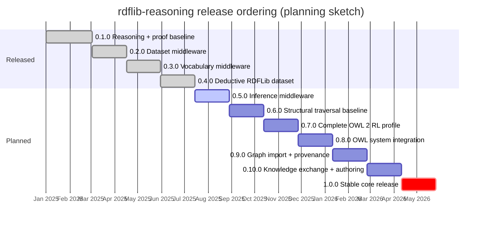
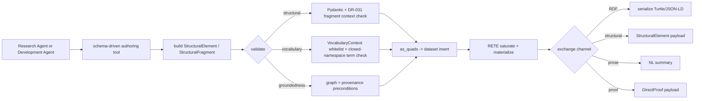

# Development Roadmap

The key words "MUST", "MUST NOT", "REQUIRED", "SHALL", "SHALL NOT", "SHOULD", "SHOULD NOT", "RECOMMENDED", "MAY", and "OPTIONAL" in this document are to be interpreted as described in [RFC 2119](https://www.ietf.org/rfc/rfc2119.txt).

## 1. How to use this document

- `architecture.md` is the authoritative description of intended system structure and behavior.
- `roadmap.md` is the authoritative description of planned feature sequencing, release scope, and delivery priority.
- The codebase remains the authority on current implementation status.
- When `roadmap.md` and `architecture.md` disagree about whether a feature belongs in the current intended scope, Development Agents MUST stop and resolve that discrepancy before continuing with substantial implementation work.
- Roadmap entries SHOULD link to the corresponding `architecture.md` section when such a section already exists and the link improves navigation without overloading the document.

## 2. Planning assumptions

- Release planning is intentionally incremental. A later release MAY be re-scoped when implementation feedback, validation work, or design clarification shows that a planned feature is under-specified or too large for the target release.
- A roadmap item may appear before it has a full architectural section. In that case, the item MUST be treated as planned intent, not fully authorized design.
- The current pre-`1.0.0` rebaseline toward OWL system integration is captured in [DR-028 Roadmap Rebaseline Toward OWL System Integration](decision-records/DR-028%20Roadmap%20Rebaseline%20Toward%20OWL%20System%20Integration.md).
- Prospective use cases are formal planning input, but they do not override this roadmap or the authoritative architecture. This posture is captured in [DR-029 Prospective Use Cases as Non-Authoritative Planning Input](decision-records/DR-029%20Prospective%20Use%20Cases%20as%20Non-Authoritative%20Planning%20Input.md).

The chart below is a *planning sketch* of release ordering and relative scope.
Release durations are illustrative and do NOT represent a committed schedule;
authoritative status is the prose under each release section.

## 3. Release `0.1.0`: Reasoning and proof baseline (released)

Priority: highest

This release establishes the minimum coherent platform for graph-backed reasoning experiments, proof interchange, and baseline demonstration.

### 3.1. In scope

1. Structural-element and middleware interoperability baseline
   - Preserve `GraphBacked` and `StructuralElement` as the schema-facing contract between middleware and Research Agents.
   - Architecture: [Structural elements and middleware](architecture.md#structural-elements-and-middleware)
1. RETE engine add-only baseline
   - Deliver the supported store integration path, fixed-point update behavior, derivation logging contract, complete informative RDFS entailment rules (`rdfs1`-`rdfs13`), and add-only JTMS-compatible support bookkeeping.
   - Architecture: [Engine event contract and entrypoint](architecture.md#engine-event-contract-and-entrypoint)
   - Architecture: [RETE Engine Design](architecture.md#rete-engine-design)
   - Architecture: [Truth Maintenance System (TMS)](architecture.md#truth-maintenance-system-tms)
1. RDF triple well-formedness enforcement
   - Enforce RDF 1.1 subject and predicate constraints at the engine boundary with a configurable handling policy.
   - Architecture: [RDF Data-Model Enforcement](architecture.md#rdf-data-model-enforcement)
1. Proof interchange models
   - Implemented: `DirectProof` and related proof payload models provide stable typed proof interchange for baseline notebooks, engine-reconstructed explanations, and future evaluation tooling.
   - Architecture: [Proof reconstruction and explanation](architecture.md#proof-reconstruction-and-explanation)
1. Initial proof rendering layer
   - Provide presentation-focused rendering over canonical proof data, with markdown-friendly output as the initial target.
   - Architecture: [Proof rendering](architecture.md#proof-rendering)
1. Initial contradiction signaling
   - Implemented: dual-channel contradiction detection with independently configurable signaling behavior.
   - Implemented: contradiction detection targets currently modeled OWL 2 RL contradiction-producing `false` rules and records non-mutating diagnostics without requiring contradiction triple materialization.
   - Architecture: [Contradiction signaling](architecture.md#contradiction-signaling)
   - Decision: [DR-027 Dual-Channel Contradiction Diagnostics and Explanation Contract](decision-records/DR-027%20Dual-Channel%20Contradiction%20Diagnostics%20and%20Explanation%20Contract.md)

### 3.2. Exit criteria

- The engine supports the documented add-only fixed-point flow and derivation logging baseline.
- The engine provides the complete informative RDFS entailment baseline (`rdfs1`-`rdfs13`) within that add-only flow.
- Proofs can be represented and rendered through stable typed interfaces.

## 4. Release `0.2.0`: Dataset middleware and experiment foundation (released)

Priority: highest

This release delivers the foundational dataset-backed middleware and the initial experiment notebook series.

### 4.1. In scope

1. Dataset-backed middleware foundation
   - Deliver the foundational dataset lifecycle needed by higher middleware layers.
   - Keep copied runtime state lightweight by treating live RDFLib datasets and coordination objects as middleware-owned infrastructure rather than `AgentState` payload.
   - Provide per-dataset multi-reader / single-writer coordination for dataset-backed tool, retrieval, and inference access without expanding the scope to general transaction support.
   - Limit `0.2.0` dataset middleware scope to the default-graph baseline: list triples, add triples, remove triples, serialize current state, and reset the dataset.
   - Implement Research Agent-facing dataset tools as thin adapters over internal middleware methods so later middleware layers and tests can compose over one source of truth.
   - Architecture: [Dataset middleware](architecture.md#dataset-middleware)
1. Middleware capability gating
   - Ensure dataset, retrieval, and inference capabilities are enabled or withheld through middleware composition rather than hidden prompt changes or ad hoc runtime paths.
   - Architecture: [Middleware composition and capability gating](architecture.md#middleware-composition-and-capability-gating)
1. Schema-facing RDF boundary models
   - Deliver Pydantic-based boundary models with lexical RDF wire forms, reusable schema aliases, and concise normative descriptions for the Research Agent communication surface.
   - Architecture: [Schema-facing RDF boundary models](architecture.md#schema-facing-rdf-boundary-models)
1. Middleware-owned dataset sessions and coordination
   - Deliver per-dataset session ownership and multi-reader / single-writer coordination.
   - Architecture: [Dataset middleware](architecture.md#dataset-middleware)
1. Dataset middleware internal method and tool adapter pattern
   - Maintain a clear separation between internal RDFLib-native methods and Research Agent-facing tool adapters.
   - Architecture: [Dataset middleware internal methods and tool adapters](architecture.md#dataset-middleware-internal-methods-and-tool-adapters)
1. Baseline and middleware demo notebooks
   - Deliver the prompt-only baseline (`demo-baseline-ontology-extraction.ipynb`) and dataset middleware condition (`demo-dataset-middleware.ipynb`) with shared evaluation infrastructure (`demo_utils.py`).

### 4.2. Exit criteria

- A Research Agent can operate over dataset-backed state with capabilities exposed only through explicit middleware composition.
- The `0.2.0` dataset middleware surface is limited to the default-graph baseline and does not yet require named-graph management or generic quad-level CRUD.
- Baseline and middleware conditions are comparable through shared evaluation metrics with reduced prompt asymmetry.

## 5. Release `0.3.0`: Vocabulary middleware and namespace discipline (released)

Priority: high

This release adds vocabulary inspection and namespace-discipline capabilities to the middleware stack, enabling Research Agents to discover, inspect, and correctly use established RDF vocabularies.
This release has been completed. The items below describe the released
`0.3.0` capability surface and the scope that was intentionally deferred to
later milestones.

### 5.1. In scope

1. RDF vocabulary middleware
   - Deliver indexed vocabulary retrieval and inspection tools (`list_vocabularies`, `list_terms`, `search_terms`, `inspect_term`) as an explicit middleware capability over locally-bundled specification files.
   - Make `search_terms` the intended primary discovery path when a Research Agent knows the meaning it wants to express but not yet the correct indexed term.
   - Architecture: [RDF vocabulary middleware](architecture.md#rdf-vocabulary-middleware)
   - Decision: [DR-017 Search-First RDF Vocabulary Retrieval](decision-records/DR-017%20Search-First%20RDF%20Vocabulary%20Retrieval.md)
1. Namespace whitelisting for dataset middleware
   - Deliver opt-in namespace whitelisting with three affordances: enforcement (rejecting non-whitelisted URIs), enumeration (listing allowed vocabularies in the prompt), and remediation (Levenshtein-based suggestions for near-miss terms in closed vocabularies).
   - Architecture: [Namespace whitelisting](architecture.md#namespace-whitelisting)
   - Decision: [DR-014 Namespace Whitelisting for Dataset Middleware](decision-records/DR-014%20Namespace%20Whitelisting%20for%20Dataset%20Middleware.md)
1. Shared middleware services and unified vocabulary configuration
   - Deliver explicit shared-service injection for dataset runtime, shared vocabulary policy, and run-local term telemetry.
   - Make `VocabularyConfiguration` the only declarative vocabulary setup surface.
   - Add `VocabularyContext` as the validated cached runtime vocabulary object injected into both dataset and vocabulary middleware.
   - Keep cross-middleware sharing explicit rather than relying on middleware composition order or raw whitelist/cache wiring.
   - Architecture: [Dataset middleware](architecture.md#dataset-middleware)
   - Architecture: [Shared middleware services](architecture.md#shared-middleware-services)
   - Architecture: [RDF vocabulary middleware](architecture.md#rdf-vocabulary-middleware)
   - Decision: [DR-020 Middleware Stack Layering and Hook-Role Boundaries](decision-records/DR-020%20Middleware%20Stack%20Layering%20and%20Hook-Role%20Boundaries.md)
1. Expanded indexed vocabulary set
   - Enable declared bundled vocabulary resources for at minimum RDF, RDFS, OWL, SKOS, and PROV. Additional well-known vocabularies MAY be enabled by extending the standard bundled vocabulary declarations in the vocabulary layer.
   - Architecture: [RDF vocabulary middleware](architecture.md#rdf-vocabulary-middleware)
1. Using VANN annotation metadata
   - Implemented: `vann:preferredNamespacePrefix` and `vann:preferredNamespaceUri` are surfaced as advisory metadata for indexed vocabulary summaries when present in bundled or user-supplied vocabularies.
   - VANN metadata improves discovery ergonomics for `RDFVocabularyMiddleware`, but MUST NOT override declared namespace policy, `VocabularyContext`, or whitelist enforcement.
   - Architecture: [RDF vocabulary middleware](architecture.md#rdf-vocabulary-middleware)
1. Vocabulary middleware demo notebook
   - Align `demo-vocabulary-middleware.ipynb` with the shared evaluation infrastructure (`demo_utils.py`) established in `0.2.0`, including shared prompts, evaluation metrics, and the parseability gate pattern.
1. Middleware execution discipline hardening
   - Add optional `ContinuationGuardMiddleware` for single-run, completion-oriented Research Agent harnesses so unfinished recovery narration and plan-only exits can be re-prompted without coupling that behavior to model-specific prompt middleware.
   - Architecture: [Continuation guard middleware](architecture.md#continuation-guard-middleware)
   - Decision: [DR-020 Middleware Stack Layering and Hook-Role Boundaries](decision-records/DR-020%20Middleware%20Stack%20Layering%20and%20Hook-Role%20Boundaries.md)
1. Silent-rule visibility and bootstrap-axiom execution
   - Introduce immutable rule-level silence semantics where `Rule.silent` defines default normal-operation visibility while `DerivationRecord.silent` carries effective per-firing visibility.
   - Require silent derivations to remain present in engine-native derivation logs using visibility metadata, while user-facing proof reconstruction excludes silent records.
   - Track bootstrap-phase firings explicitly in derivation logs so bootstrap overrides do not overload rule-level `silent`.
   - Execute zero-precondition bootstrap rules once per engine-context initialization before warmup over existing graph content; reopening a context MAY re-run bootstrap idempotently.
   - Keep triples produced solely by bootstrap and bootstrap-only closure internal to the engine so empty-graph startup does not materialize background vocabulary closure.
   - Architecture: [Engine event contract and entrypoint](architecture.md#engine-event-contract-and-entrypoint)
   - Architecture: [Truth Maintenance System (TMS)](architecture.md#truth-maintenance-system-tms)
   - Decision: [DR-022 Bootstrap-Phase Effective Visibility and Derivation Metadata](decision-records/DR-022%20Bootstrap-Phase%20Effective%20Visibility%20and%20Derivation%20Metadata.md)

### 5.2. Exit criteria

- A Research Agent with the completed `0.3.0` vocabulary middleware can
  discover relevant indexed vocabulary terms through search and inspect them
  before using them in `add_triples`.
- Dataset-backed middleware uses an explicit `VocabularyContext` rather than
  bare constructors or separately wired whitelist/cache objects.
- Dataset and vocabulary middleware can share an explicitly injected runtime,
  vocabulary context, and run-local telemetry service without implicit
  middleware discovery.
- Vocabulary middleware can surface VANN annotation metadata for indexed
  vocabularies when it is present, without changing which namespaces are
  declared or whitelisted.
- The vocabulary middleware demo notebook uses the same shared evaluation infrastructure as baseline and dataset middleware demos, enabling quantitative comparison across all three conditions.
- The completed `0.3.0` indexed vocabulary set includes at minimum the core
  Semantic Web vocabularies (RDF, RDFS, OWL, SKOS, PROV).
- Optional continuation-guard middleware is available for single-run harnesses without being implied for multi-round conversational agents.
- Silent-rule visibility semantics are implemented so silent derivations remain logged while reconstructed user-facing proofs exclude silent records.
- Zero-precondition bootstrap rules execute once per engine-context initialization before warmup over existing graph content, with idempotent behavior across reopen/recreate and without materializing bootstrap-only closure back into the graph.

## 6. Release `0.4.0`: Deductive RDFLib dataset behavior (released)

Priority: highest

This release completes the reusable RDFLib-facing deduction substrate. It is
valuable to downstream Python consumers even without Research Agent middleware:
an RDFLib dataset can use the reasoning store, materialize supported deductions,
track supports, retract stated facts safely, and expose explanations or
diagnostics through stable typed models.

### 6.1. In scope

1. Deductive RDFLib store integration
   - Deliver `RETEStore` as the supported RDFLib store adapter for
     materializing deductions from store events.
   - Preserve the documented event flow from RDFLib store mutation through
     `BatchDispatcher`, `RETEEngine`, and materialization.
   - Architecture: [Engine event contract and entrypoint](architecture.md#engine-event-contract-and-entrypoint)
1. Complete RDFS deduction baseline
   - Provide the complete informative RDFS entailment rule set (`rdfs1` through
     `rdfs13`) and RDF/RDFS axiomatic support needed by the production profile.
   - Keep production visibility and conformance-oriented testing profiles
     explicit so silent/bootstrap behavior remains inspectable.
   - Architecture: [Engine event contract and entrypoint](architecture.md#engine-event-contract-and-entrypoint)
1. JTMS support verification and recursive retraction
   - Implement support snapshots, hypothetical support-path invalidation checks,
     transitive support verification, dependency traversal, recursive
     Mark-Verify-Sweep retraction, and store/engine removal wiring.
   - Architecture: [Truth Maintenance System (TMS)](architecture.md#truth-maintenance-system-tms)
   - Decision: [DR-023 JTMS Support Verification API Surface](decision-records/DR-023%20JTMS%20Support%20Verification%20API%20Surface.md)
   - Decision: [DR-024 TMSController Recursive Retraction](decision-records/DR-024%20TMSController%20Recursive%20Retraction.md)
   - Decision: [DR-025 RETE Store Removal Wiring and Re-Materialization Policy](decision-records/DR-025%20RETE%20Store%20Removal%20Wiring%20and%20Re-Materialization%20Policy.md)
1. Proof reconstruction and rendering for engine outputs
   - Preserve `DirectProof` as the canonical proof interchange model for
     reconstructed triple-goal explanations.
   - Keep markdown, Mermaid, and notebook rendering separate from canonical
     proof structures.
   - Architecture: [Proof reconstruction and explanation](architecture.md#proof-reconstruction-and-explanation)
   - Architecture: [Proof rendering](architecture.md#proof-rendering)
1. Contradiction diagnostics baseline
   - Provide the dual-channel contradiction diagnostics contract for currently
     modeled OWL 2 RL contradiction-producing rule families without mutating
     logical closure.
   - Preserve contradiction-goal proof reconstruction and rendering where
     retained diagnostics are available.
   - Architecture: [Contradiction signaling](architecture.md#contradiction-signaling)
   - Decision: [DR-027 Dual-Channel Contradiction Diagnostics and Explanation Contract](decision-records/DR-027%20Dual-Channel%20Contradiction%20Diagnostics%20and%20Explanation%20Contract.md)
1. RDFLib-level tutorial and demonstration notebooks
   - Maintain quick demonstrations for RDFS inference, proof reconstruction,
     and contradiction diagnostics as package-facing evidence of the substrate.

### 6.2. Exit criteria

- RDFLib users can create a deductive dataset backed by the reasoning store and
  observe complete RDFS materialization through ordinary graph mutation.
- Derived facts remain present or are removed according to support validity
  rather than naive event mirroring.
- Triple-goal explanations and contradiction diagnostics can be reconstructed
  and rendered without exposing raw engine internals as the user-facing surface.
- Performance-oriented relation indexes remain out of scope for this release.

## 7. Release `0.5.0`: Inference middleware

Priority: highest

This release exposes the deductive substrate to Research Agents through explicit
middleware composition. It turns inference from a Python/RDFLib capability into
a controlled runtime affordance over dataset-backed state.

### 7.1. In scope

1. Inference middleware capability boundary
   - Add inference middleware as the explicit way to expose reasoning behavior
     to a Research Agent.
   - Ensure a Research Agent without inference middleware cannot accidentally
     invoke inference or explanation behavior through another middleware path.
   - Architecture: [Middleware composition and capability gating](architecture.md#middleware-composition-and-capability-gating)
   - Architecture: [Inference middleware](architecture.md#inference-middleware)
1. Deductive dataset runtime integration
   - Compose inference middleware over `DatasetMiddleware` and the shared
     `DatasetRuntime` coordination boundary.
   - Ensure inference operates on the same dataset-backed state as manual graph
     updates, vocabulary-constrained modeling, and later graph import.
   - Architecture: [Dataset middleware](architecture.md#dataset-middleware)
   - Architecture: [Shared middleware services](architecture.md#shared-middleware-services)
1. Research Agent-facing inference and explanation tools
   - Expose reasoner-backed behavior through explicit tools or schema-visible
     responses rather than hidden side effects.
   - If derivations are exposed to the Research Agent, expose them through
     structured proof models such as `DirectProof` rather than raw derivation
     logs.
   - Architecture: [Inference middleware](architecture.md#inference-middleware)
1. Contradiction diagnostic access
   - Expose retained contradiction diagnostics through a read-only, controlled
     middleware surface when the configured recorder supports retention.
   - Keep contradiction diagnostics distinct from logical closure mutation.
   - Architecture: [Contradiction signaling](architecture.md#contradiction-signaling)
1. Inference middleware demos and evaluation hooks
   - Add or update notebooks that compare baseline, dataset-backed, and
     inference-enabled Research Agent conditions through middleware composition.
   - Preserve compatibility with tracing and proof-rendering tools.

### 7.2. Exit criteria

- Research Agent-facing inference is capability-gated by middleware inclusion.
- Inference middleware composes over the same dataset runtime and coordination
  boundary as dataset and vocabulary middleware.
- Explanations and diagnostics cross the Research Agent boundary as stable,
  typed models or schema-visible tool responses rather than engine internals.

## 8. Release `0.6.0`: OWL structural traversal and representation baseline

Priority: highest

This release makes OWL 2 RDF mapping usable in both directions for supported
constructs. Structural elements stop being only serialization helpers and
become a traversal, representation, and text-generation layer over graph
content.

### 8.1. In scope

1. Structural traversal over RDF graphs
   - Implement traversal that partitions supported RDF graph content into
     explicit `StructuralElement` or `GraphBacked` objects.
   - Traverse graphs containing asserted triples, inferred triples, or both.
   - Architecture: [Structural traversal and representation](architecture.md#structural-traversal-and-representation)
1. OWL 2 RDF mapping coverage baseline
   - Prioritize constructs needed to demonstrate class axioms, property axioms,
     assertions, declarations, and representative expression forms.
   - Keep coverage aligned with the OWL 2 mapping index and the
     `rdflib-reasoning-axioms` feature matrix.
   - Architecture: [Structural elements and middleware](architecture.md#structural-elements-and-middleware)
1. Stable ordering and deterministic text representation
   - Define stable ordering for traversed structural elements so repeated graph
     traversal produces deterministic text and schema payloads.
   - Render structural elements as concise prose using labels, CURIEs, and
     deterministic fallback identifiers.
   - Architecture: [Structural traversal and representation](architecture.md#structural-traversal-and-representation)
1. Inferred-content traversal checks
   - Include tests or demos over graphs that contain inferred triples, even
     before complete OWL 2 RL materialization is available.
   - Preserve the architectural requirement that inferred OWL-level facts can
     later be lifted into structural representations.
   - Architecture: [OWL system composition](architecture.md#owl-system-composition)

### 8.2. Exit criteria

- Supported RDF graph patterns can be lifted into structural objects and
  rendered deterministically as text.
- Traversal works over graphs containing asserted and inferred content.
- The feature matrix, spec index, and traversal behavior remain aligned enough
  for Development Agents to reason about coverage and gaps.

## 9. Release `0.7.0`: Complete OWL 2 RL materialization profile

Priority: highest

This release implements complete OWL 2 RL rule coverage for the repository's
forward-chaining materialization profile, including the interaction between
triple materialization, contradiction diagnostics, proof reconstruction, and
structural traversal.

### 9.1. In scope

1. Complete OWL 2 RL materialization rules
   - Implement the OWL 2 RL triple-producing rule families indexed by the local
     OWL 2 reasoning profile specification.
   - Preserve RDF data-model enforcement, support bookkeeping, derivation
     logging, and retraction compatibility for new rule families.
   - Architecture: [RETE Engine Design](architecture.md#rete-engine-design)
   - Architecture: [Engine event contract and entrypoint](architecture.md#engine-event-contract-and-entrypoint)
1. Complete OWL 2 RL contradiction diagnostics
   - Complete the repository's dual-channel treatment of OWL 2 RL
     contradiction-producing `false` rules.
   - Preserve non-mutating diagnostics and contradiction-goal proof
     reconstruction.
   - Architecture: [Contradiction signaling](architecture.md#contradiction-signaling)
1. OWL structural traversal compatibility
   - Verify that representative inferred OWL 2 RL outputs can be traversed into
     structural representations when they correspond to supported constructs or
     assertions.
   - Architecture: [OWL system composition](architecture.md#owl-system-composition)
1. OWL 2 RL conformance and demonstration artifacts
   - Add rule-level tests, profile-level regression coverage, and notebooks or
     examples that show inferred OWL-level axioms or assertions being produced
     and then lifted into structural form.

### 9.2. Exit criteria

- The engine provides complete OWL 2 RL materialization coverage for the
  repository's forward-chaining OWL 2 RL profile.
- Contradiction-producing OWL 2 RL rules are represented through diagnostics
  rather than synthetic contradiction triples.
- Representative inferred OWL outputs can be traversed, rendered, explained,
  and tested through the structural layer.

## 10. Release `0.8.0`: OWL system integration baseline

Priority: high

This release proves that the OWL-facing pieces compose as a coherent system:
asserted and inferred OWL structures can be represented, explained, rendered,
and exchanged through stable interfaces.

### 10.1. In scope

1. Asserted-and-inferred OWL integration demos
   - Demonstrate graphs containing asserted and inferred OWL content flowing
     through inference, traversal, proof/explanation, rendering, and text
     representation.
   - Architecture: [OWL system composition](architecture.md#owl-system-composition)
1. Proof and structural representation alignment
   - Ensure proof payloads can refer to triple-level facts and structural
     objects where each representation is natural.
   - Architecture: [Proof evaluation harness inputs and outputs](architecture.md#proof-evaluation-harness-inputs-and-outputs)
   - Architecture: [OWL system composition](architecture.md#owl-system-composition)
1. Baseline proof-evaluation workflow support
   - Deliver or update framework-agnostic proof assessment models and notebook
     integration as needed for the integrated OWL demos.
   - Architecture: [Proof evaluation harness](architecture.md#proof-evaluation-harness)
1. Integration documentation
   - Update README and notebook guidance so users can follow the path from
     RDFLib-level inference to Research Agent-facing OWL system behavior.

### 10.2. Exit criteria

- The repository can demonstrate asserted and inferred OWL content moving
  through inference, traversal, proof/explanation, rendering, and stable text.
- Integrated examples use typed interfaces rather than ad hoc dictionaries or
  raw engine logs at user-facing boundaries.
- Proof evaluation infrastructure is sufficient for baseline OWL-system demos
  and remains framework-agnostic at its core.

## 11. Release `0.9.0`: Graph import and provenance baseline

Priority: high

This release adds controlled graph import and provenance infrastructure without
committing to remote provider-specific retrieval. It prepares the system to
ingest external graph content while preserving source, trust, and graph-context
metadata.

### 11.1. In scope

1. Graph import baseline
   - Support loading RDF content into controlled graph or dataset contexts.
   - Keep import mechanics separate from remote entity-resolution or provider
     ranking policy.
   - Architecture: [Graph import, provenance, and knowledge retrieval](architecture.md#graph-import-provenance-and-knowledge-retrieval)
1. Provenance-bearing imported graph content
   - Attach provenance sufficient to explain where imported facts originated,
     how they were imported, and which graph or dataset context owns them.
   - Model provenance artifacts as `GraphBacked` structures when they cross the
     Research Agent boundary.
   - Architecture: [Graph import, provenance, and knowledge retrieval](architecture.md#graph-import-provenance-and-knowledge-retrieval)
1. Named graph and graph-scoped operations
   - Add named graph management and graph-scoped triple operations when they are
     needed to represent imported graph boundaries and provenance cleanly.
   - Architecture: [Dataset middleware capability phases](architecture.md#dataset-middleware-capability-phases)
1. Import demonstrations
   - Demonstrate local or controlled import into dataset-backed state with
     provenance preserved through serialization, traversal, and explanation
     where applicable.

### 11.2. Exit criteria

- Imported RDF content can be placed into controlled graph or dataset contexts.
- Imported facts can be traced to source/provenance metadata suitable for
  debugging, evaluation, and later knowledge exchange.
- Remote service retrieval remains out of scope for this release.

## 12. Release `0.10.0`: Knowledge exchange and axiom-authoring tools

Priority: high

This release gives Research Agents and downstream systems a controlled way to
author, validate, exchange, and serialize structured knowledge through RDF,
structural axioms, prose, proof objects, and schema-driven payloads.

### 12.1. In scope

1. Axiom-authoring interfaces
   - Expose tools or schema-driven APIs for creating supported structural
     axioms directly rather than forcing agents to author only raw triples.
   - Architecture: [Knowledge exchange and axiom authoring](architecture.md#knowledge-exchange-and-axiom-authoring)
1. Validation and quality checks
   - Validate authored axioms against structural constraints, graph content,
     vocabulary policy, provenance, and groundedness requirements where
     applicable.
   - Architecture: [Knowledge exchange and axiom authoring](architecture.md#knowledge-exchange-and-axiom-authoring)
1. Multi-channel serialization
   - Serialize knowledge as RDF, structural objects, prose/text, proof payloads,
     or combinations of those outputs depending on the consumer.
   - Architecture: [Knowledge exchange and axiom authoring](architecture.md#knowledge-exchange-and-axiom-authoring)
1. Exchange-oriented demos
   - Demonstrate a Research Agent creating or revising structured knowledge and
     exchanging it through at least two representation channels.
   - Prospective use case: [Knowledge Exchange](prospective-use-cases.md#knowledge-exchange)

The flowchart below is a *planned* axiom-authoring round-trip. It describes the
intended developer/Research Agent experience for this release; the implementation
does not yet exist and the diagram MUST be treated as planning intent rather than
authoritative current behavior.

> Planned only: depicts release `0.10.0` intent; not implemented today.

### 12.2. Exit criteria

- Research Agents can author supported structured axioms through schema-visible
  interfaces and add them to dataset-backed state.
- Authored knowledge can be validated, serialized, and rendered without
  bypassing structural or provenance contracts.
- Knowledge exchange builds on structural traversal, OWL system integration, and
  graph provenance rather than defining a separate interchange path.

## 13. Release `1.0.0`: Stable core infrastructure release

Priority: highest

This release marks the point where the core system works end-to-end. It is not
the end of the research program; it is the stable infrastructure boundary before
remote retrieval providers, learned inference layers, packaging experiments,
and hybrid query-time inference become primary roadmap concerns.

### 13.1. In scope

1. Core documentation and public tutorial path
   - Present a coherent public path through RDFLib-level inference, Research
     Agent middleware, structural traversal, OWL 2 RL materialization, graph
     provenance, and knowledge exchange.
1. Release hardening
   - Resolve known architectural drift, update package READMEs, validate
     notebooks that function as public demos, and run repository validation.
1. Citation metadata
   - Provide maintained repository citation guidance through `CITATION.cff`.
1. Release citation and archival guidance
   - Document the release citation path and prepare stable DOI-oriented archival
     integration.
1. Zenodo presentation
   - Add Zenodo-oriented citation guidance and repository badges once the
     release workflow and metadata are stable.

### 13.2. Exit criteria

- The repository exposes a coherent pre-`1.0.0` core: deductive RDFLib datasets,
  inference middleware, structural traversal, complete OWL 2 RL materialization,
  OWL system integration, graph provenance, and knowledge exchange.
- Public README and notebook guidance describe how to use and evaluate the core
  system.
- Citation guidance is visible to readers of the repository and release
  artifacts.

### 13.3. Open question

- Decide whether repository citation metadata should cite the metapackage
  release, the software family as a whole, or both.

## 14. Post-`1.0.0` enhancements and experimental adoption tracks

The following tracks are intentionally outside the core pre-`1.0.0` roadmap.
They may be pulled forward only when a concrete experiment shows that doing so
is necessary and measurable.

### 14.1. Specific remote service retrieval

Remote service retrieval includes DBpedia, Wikidata, JSON-LD-from-web, entity
resolution, provider-specific ranking, and remote import policy.

- Remote retrieval SHOULD reuse graph-import and provenance contracts rather
  than defining provider-specific provenance semantics.
- Provider-specific retrieval SHOULD remain capability-gated by middleware or
  similarly explicit runtime composition.

### 14.2. LangGraph skills and subagent packaging experiments

LangGraph skill packaging and subagent packaging are non-monotonic adoption
experiments rather than guaranteed architectural milestones. This planning
posture is recorded in
[DR-030 Packaging Experiments as Post-Core Adoption Tracks](decision-records/DR-030%20Packaging%20Experiments%20as%20Post-Core%20Adoption%20Tracks.md).

- Skill packaging MAY be evaluated after repeated workflows have stable inputs,
  outputs, and evaluation criteria.
- Subagent packaging MAY be evaluated for bounded workflows such as retrieval,
  axiom authoring, proof critique, or structural summarization.
- These tracks MAY result in adoption, partial adoption, or rejection depending
  on measured reliability, latency, token cost, and ergonomics.

### 14.3. Graph embeddings, GIL datasets, and learned inference layers

Graph embeddings, Graph Inference Layers, closure dataset generation, and
learned reasoners are post-core research expansions.

- These tracks SHOULD build on stable graph ordering, structural text
  representation, complete symbolic closure generation, provenance, and
  evaluation infrastructure.

### 14.4. Backward chaining and hybrid query-time inference

Backward chaining and hybrid query-time inference remain later reasoning
expansions after the forward-chaining, structural, and exchange layers are
stable.

- Hybrid inference SHOULD preserve the explicit proof, provenance, and
  capability-gating contracts established by the core roadmap.

## 15. Release review rules

- Development Agents SHOULD consult this roadmap when estimating scope, selecting the next feature to implement, or deciding whether a task belongs in the current release.
- Development Agents MUST verify that this roadmap remains accurate before closing a substantial feature task that changes Python behavior, middleware capability boundaries, release scope, or architectural assumptions.
- Development Agents MUST consider reprioritizing roadmap items or moving scope across releases when implementation uncovers missing architectural detail, hidden dependency chains, validation failures, or feature slices too large to complete coherently within the current release target.
