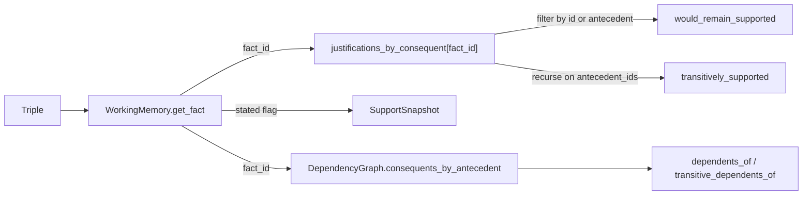

# JTMS support verification APIs (roadmap §7.1.1)

## Context

- Roadmap §7.1.1 in [docs/dev/roadmap.md](docs/dev/roadmap.md) calls for "support-checking behavior needed to decide whether conclusions remain justified after a support path is invalidated."
- Architecture's TMS section at [docs/dev/architecture.md](docs/dev/architecture.md) line 472 stages this as step (2) of a 4-step plan, between already-completed support recording and the future recursive Mark-Verify-Sweep.
- Today's [rdflib-reasoning-engine/src/rdflib_reasoning/engine/rete/tms.py](rdflib-reasoning-engine/src/rdflib_reasoning/engine/rete/tms.py) records `Justification`s and a bidirectional `DependencyGraph` but only exposes coarse `is_supported` / `support_count` / `justifications_for`. Per the user's scope choice, `is_supported` will not be tightened and no `RETEEngine` convenience facade will be added in this PR.
- Engine-level retraction stubs (`RETEEngine.retract_triples`, `RETEStore.remove`, `_on_triples_removed`) remain untouched: this PR is purely additive.

## API surface (engine-internal, not a Research Agent boundary)

Add to [tms.py](rdflib-reasoning-engine/src/rdflib_reasoning/engine/rete/tms.py):

- Add stable public id to `Justification`:
  - New field `id: str`, populated by `TMSController.record_derivation` from the existing `_justification_key(...)`. Migrate `_justification_key` from `@staticmethod` to a module-level helper or keep as-is and assign during record. The `justifications_by_consequent: dict[str, dict[str, Justification]]` map continues to use the same keys; no behavior change.
- New immutable verdict type:

```python
class SupportSnapshot(BaseModel):
    """Immutable view of a fact's TMS support state at a moment in time."""
    model_config = ConfigDict(frozen=True, arbitrary_types_allowed=True)
    triple: Triple
    fact_id: str | None
    is_present: bool
    is_stated: bool
    justification_ids: tuple[str, ...]
    @property
    def justification_count(self) -> int: ...
    @property
    def is_supported(self) -> bool:
        return self.is_present and (self.is_stated or self.justification_count > 0)
```

- New `TMSController` methods (all read-only, all consult only `working_memory`, `dependency_graph`, and `justifications_by_consequent`):
  - `support_snapshot(triple: Triple) -> SupportSnapshot`
  - `would_remain_supported(triple, *, without_justification_id: str | None = None, without_antecedent_id: str | None = None) -> bool` — exactly one of the kwargs MUST be provided. Walks `justifications_by_consequent[fact.id]` and returns `True` if `fact.stated` or any *other* justification still exists. For `without_antecedent_id`, a justification "still exists" iff that antecedent is not in `antecedent_ids`.
  - `transitively_supported(triple) -> bool` — `is_supported` AND for every justification, every antecedent fact is itself `transitively_supported`. Cycle-safe via a visited set; in the add-only DAG this never cycles, but the verifier MUST be safe against future graph shapes.
  - `dependents_of(triple) -> tuple[str, ...]` — direct fact-id consequents from `consequents_by_antecedent`.
  - `transitive_dependents_of(triple) -> tuple[str, ...]` — BFS over `consequents_by_antecedent` returning fact ids in deterministic (sorted) order; cycle-safe.
  - `justifications_for_fact_id(fact_id: str) -> tuple[Justification, ...]` — companion to existing `justifications_for(triple)` since traversal yields fact ids.

Semantics commitments (locked in by DR):

- Silent justifications contribute identically to support validity, per architecture line 470 ("Silent support semantics"). The verifier MUST NOT consult `Rule.silent` or `DerivationRecord.silent`.
- A stated fact is `is_supported` and `transitively_supported` regardless of justification count, per architecture line 469.
- `would_remain_supported` is hypothetical; it MUST NOT mutate any TMS state.

## File-by-file changes

- [rdflib-reasoning-engine/src/rdflib_reasoning/engine/rete/tms.py](rdflib-reasoning-engine/src/rdflib_reasoning/engine/rete/tms.py): add `Justification.id`, populate it in `record_derivation`, add `SupportSnapshot`, add the six new methods.
- [rdflib-reasoning-engine/src/rdflib_reasoning/engine/rete/__init__.py](rdflib-reasoning-engine/src/rdflib_reasoning/engine/rete/__init__.py): export `SupportSnapshot` alongside the existing `DependencyGraph`, `Justification`, `TMSController`, `WorkingMemory`.
- [rdflib-reasoning-engine/tests/test_package_layout.py](rdflib-reasoning-engine/tests/test_package_layout.py): add `SupportSnapshot` to `test_rete_package_exposes_split_internal_stubs`.
- [rdflib-reasoning-engine/tests/test_engine.py](rdflib-reasoning-engine/tests/test_engine.py): extend the file with a new test cluster covering the new APIs (see "Test plan" below). Reuse the existing `Rule` fixture pattern from `test_rete_engine_tracks_multiple_supports_for_one_derived_fact` at line 1045.
- [docs/dev/decision-records/DR-023 JTMS Support Verification API Surface.md](docs/dev/decision-records/DR-023%20JTMS%20Support%20Verification%20API%20Surface.md): new DR following [docs/dev/decision-records/template.md](docs/dev/decision-records/template.md). Status Accepted. Cites the staged plan in `architecture.md` line 472, names the verdict type and method signatures, and explicitly defers Mark-Verify-Sweep to a future DR.
- [docs/dev/decision-records/INDEX.md](docs/dev/decision-records/INDEX.md): add DR-023 row dated today (2026-04-27); does not supersede any prior DR.
- [docs/dev/architecture.md](docs/dev/architecture.md): in the TMS section, mark step (2) of the staged plan as implemented and add a sentence linking the verifier API to DR-023. Do not change the staged plan's wording for steps (3) and (4).

## Data flow



## Test plan

Add to [test_engine.py](rdflib-reasoning-engine/tests/test_engine.py) (or a new `tests/test_tms.py` if the file gets unwieldy):

- `test_support_snapshot_for_stated_fact_reports_stated_and_no_justifications`
- `test_support_snapshot_for_derived_fact_reports_justifications_with_stable_ids`
- `test_support_snapshot_for_unknown_triple_returns_absent`
- `test_would_remain_supported_when_alternative_justification_exists` (multi-support fixture from line 1045)
- `test_would_remain_supported_returns_false_when_only_path_is_excluded`
- `test_would_remain_supported_for_stated_fact_returns_true_regardless_of_excluded_path`
- `test_would_remain_supported_requires_exactly_one_kwarg`
- `test_transitively_supported_for_chain_of_derivations` (A subClassOf B, B subClassOf C, alice a A => alice a C is transitively supported)
- `test_transitively_supported_is_cycle_safe` (synthetic justification graph with a cycle)
- `test_dependents_of_returns_direct_consequents`
- `test_transitive_dependents_of_returns_full_downstream_set_in_deterministic_order`
- `test_silent_derivation_contributes_to_support_validity` (uses a `Rule(silent=True)` and asserts `would_remain_supported` and `transitively_supported` treat the silent justification identically to a non-silent one)
- `test_support_verification_does_not_mutate_tms_state` (snapshot `working_memory.facts()` and `justifications_by_consequent` before/after)

## Validation

- `make validate test` per [AGENTS.md](AGENTS.md). Fix any lints or type errors introduced.
- `make check` if the DR or architecture edits trigger markdownlint.

## Out of scope (explicit deferrals)

- Recursive retraction / Mark-Verify-Sweep (roadmap §7.1.3, architecture step (3)).
- Wiring `RETEEngine.retract_triples`, `RETEStore.remove`, or `_on_triples_removed` (roadmap §7.1.4, architecture step (4)).
- An `RETEEngine` convenience facade over the new methods.
- Tightening `TMSController.is_supported` to require transitive validity.
- Specialized relation indexes (§7.1.5) and richer contradiction explanation (§7.1.6); both are independent threads that can advance in parallel later.
