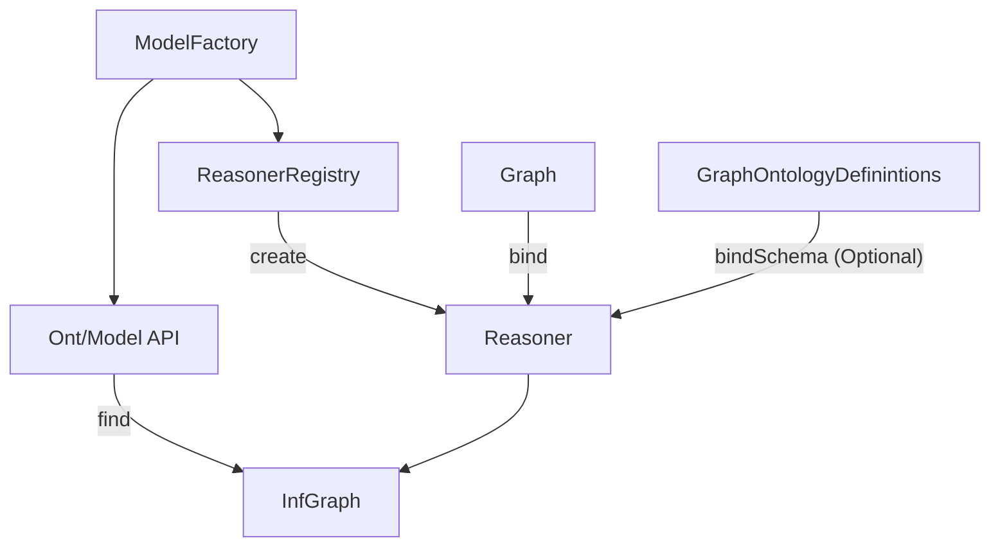
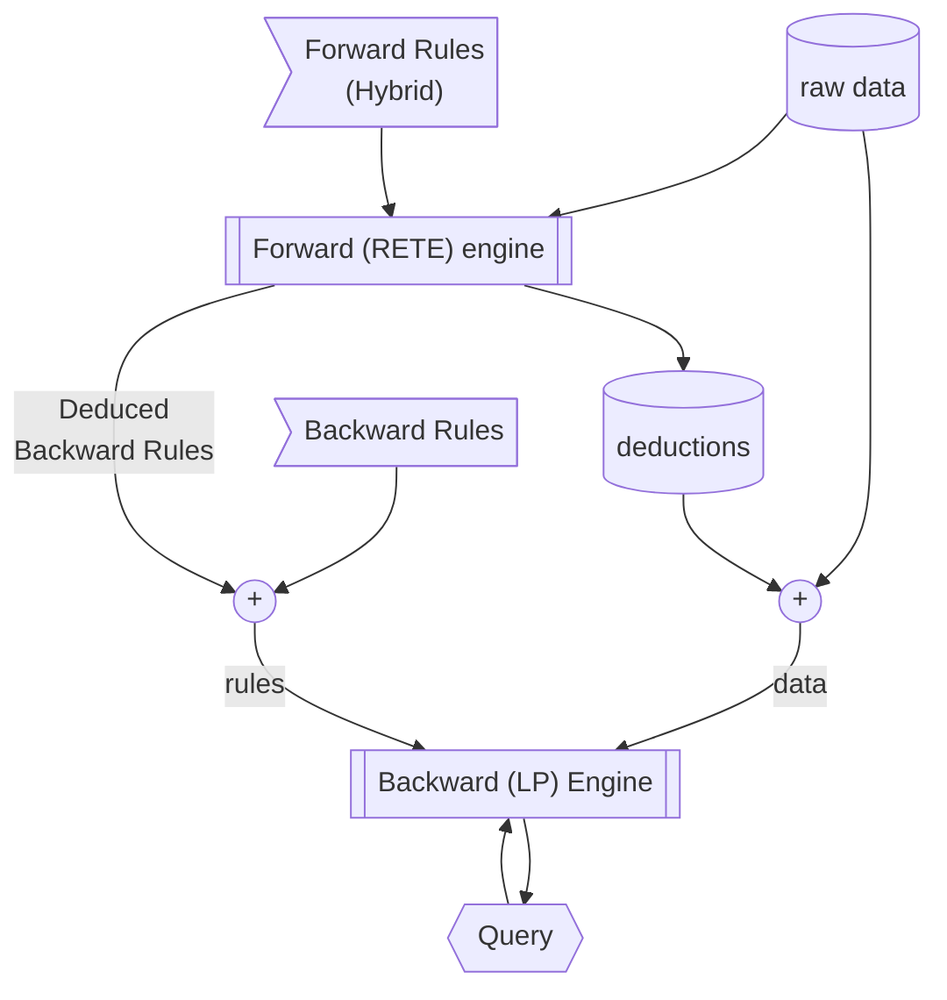

# Select Data Flows

A lot of information regarding the processing of the Apache Jena inference engines is encoded in `.png` files.
For a LLM, these are a lot harder to digest than `.dot`, `.svg`, or Mermaid.
I handcraft some approximations of their general structure below for consumers of [inference.html](./inference.html)

- Section headings and levels match those in `inference.html`, use them for navigation
- Before each `mermaid` code block, a sentence is given in block-quote (`>`). This matches the sentence preceding the corresponding diagram in `inference.html`, and can be used for cross reference.

## Overview of inference support

> The overall structure of the inference machinery is illustrated below.

## The general purpose rule engine

### Hybrid rule engine

> When run in this hybrid mode the data flows look something like this:

