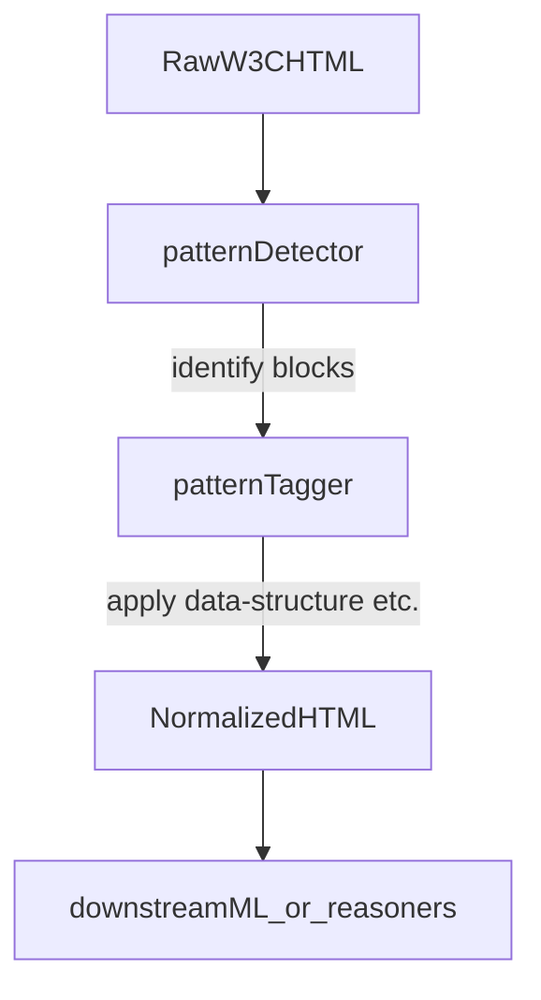

# W3C Structural Patterns for RDF/OWL Specs

This document catalogs recurring structural patterns in the W3C RDF 1.1 and OWL 2 specifications under `docs/specs/*/raw.html`, and defines how each pattern should be normalized into a lightweight HTML schema optimized for automated processing (e.g., Development Agent and Python scripts).

The primary consumer of this file is tooling. Human readability is secondary; headings, identifiers, and field names are chosen to be stable and script-friendly.

---

## 1. Normalization Schema

This section defines the **target HTML vocabulary** that normalization scripts should emit when transforming raw W3C HTML.

### 1.1 Block-level attributes

Normalized documents SHOULD use standard HTML5 sectioning and block elements (`section`, `article`, `aside`, `figure`, `header`, `footer`, `nav`, `pre`, `code`, `table`, `thead`, `tbody`, `tr`, `th`, `td`, `dl`, `dt`, `dd`), plus the following attributes:

- **`data-structure`**: semantic type of the block. Allowed values:
  - `definition`
  - `notation`
  - `example`
  - `illegal-example`
  - `note`
  - `issue`
  - `rule` (constraint, condition, requirement)
  - `test-type` (syntactic/semantic test categorization)
  - `test-format` (test case ontology / format description)
  - `grammar`
  - `code` (code listing outside of an example)
  - `mapping` (mapping between syntaxes or representations)
  - `reference` (bibliographic entry/list)
  - `metadata` (status, patent, versioning, errata, etc.)

- **`data-normativity`**: normative status of the content. Allowed values:
  - `normative`
  - `informative`
  - `mixed` (normative and informative content interleaved)
  - `unspecified` (no reliable signal)

- **`data-role`**: role of the section within the document. Allowed values:
  - `intro` (Introduction / Abstract / Notation and Terminology)
  - `conformance` (Conformance sections, tool/document conformance)
  - `semantics` (formal semantics, entailment regimes, interpretations)
  - `profiles` (profiles/species definitions)
  - `examples` (collections of examples)
  - `appendix`
  - `references-normative`
  - `references-informative`
  - `test-suite`

- **`data-origin`** (optional): identifier for the source spec and anchor. Value SHOULD be:
  - `<spec-id>#<anchor-id>`
  - Examples:
    - `owl2-structure-syntax#Preliminary_Definitions`
    - `owl2-conformance#Document_Conformance`
    - `rdf11-semantics#notation`
    - `rdf11-primer#section-data`

- **`data-label`** (optional): human-facing label, where present in the source:
  - Example: `Example 2`, `Table 1`, `Theorem PR1`.

### 1.2 Inline classes

Use the following **inline classes** to preserve semantic roles that matter to reasoning and parsing:

- **`.rfc-keyword`**
  - Applied to RFC 2119/8174 keywords (`MUST`, `MUST NOT`, `SHOULD`, `SHOULD NOT`, `MAY`) when they appear as normative markers.
  - Normalized form SHOULD keep the keyword text (uppercase) and attach the class.

- **`.grammar-nonterminal`**
  - For grammar nonterminals such as `ClassExpression`, `Assertion`, etc.

- **`.syntax-token`**
  - For literal tokens or symbolic constructs in grammars and code snippets (e.g., `'PropertyRange'`, `{`, `}`, `|`, `(`, `)`).

- **`.term-ref`**
  - For inline notational terms that are significant but not defined via `<dfn>` in the normalized output (e.g., UML class names in prose).

### 1.3 Inline elements

- **`dfn`**
  - Used to mark the first definition of a term or notation within a normalized block.
  - Should be used when the source uses `<dfn>`, `a.internalDFN`, `a.externalDFN`, or equivalent definition conventions.

- **`code`**
  - Used for literal syntax fragments, terminal symbols, and short code snippets.
  - Should avoid inheriting irrelevant presentational classes from the source.

---

## 2. Pattern Catalog

Each pattern section below follows a consistent, machine-friendly structure:

- **Pattern ID**: short, stable identifier.
- **Category**: high-level family (examples, grammar, rfc-keyword, mapping, conformance, definition, reference, metadata).
- **Raw selectors**: CSS-like selector hints over the raw W3C HTML.
- **Raw examples**: small HTML snippets from specific specs.
- **Normalize to**: target HTML structure using the schema in §1.
- **Algorithm**: step-by-step recipe for a normalizer.
- **Edge cases**: special handling rules.

### 2.1 Pattern: example-block-owl-anexample

- **Pattern ID**: `example-block-owl-anexample`
- **Category**: `examples`
- **Raw selectors**:
  - `div.anexample`
  - context: often near structural definitions or explanatory prose.

- **Raw examples**:

  - **Source**: `owl2-structure-syntax#Preliminary_Definitions`

    ```html
    <div class="anexample">
      <p>The sentence "The individual <span class="name">I</span> is an instance of the class
         <span class="name">C</span>" can be understood as a statement that ...</p>
    </div>
    ```

  - **Source**: `owl2-structure-syntax#Preliminary_Definitions` (duplicate-elimination)

    ```html
    <div class="anexample">
      <p>An ontology written in functional-style syntax can contain the following class expression:</p>
      <table class="fss">...</table>
      <table class="rdf" style="display: none">...</table>
    </div>
    ```

- **Normalize to**:

  - Wrap in `aside` with `data-structure="example"` and `data-normativity="informative"`.
  - Preserve internal paragraph and code/grammar content, but drop purely presentational classes like `anexample`, `fss`, `rdf` (unless separately captured as grammar/mapping).
  - Example target shape:

    ```html
    <aside data-structure="example"
           data-normativity="informative"
           data-origin="owl2-structure-syntax#Preliminary_Definitions">
      <!-- content from the example -->
    </aside>
    ```

- **Algorithm**:
  - Find each `div.anexample`.
  - Compute `data-origin` from the closest enclosing section `id` and spec identifier.
  - Replace `div.anexample` with `aside`, remove the `class` attribute (children may keep semantically meaningful classes).
  - If the example has an explicit label (none in this specific pattern), record it in `data-label`.
  - Preserve inner HTML structure, but do not propagate `style` attributes or onclick handlers.

- **Edge cases**:
  - **Nested grammar or code**: if the example contains `table.fss` / `table.rdf` or similar, ALSO tag those inner tables as grammar/mapping per pattern `grammar-bnf-table` and `mapping-fss-rdf-example`.
  - **Long examples**: allow splitting across multiple `pre` blocks; do not attempt to re-wrap or reflow code.

### 2.2 Pattern: example-block-rdf11-primer

- **Pattern ID**: `example-block-rdf11-primer`
- **Category**: `examples`
- **Raw selectors**:
  - `div.example` (RDF 1.1 Primer examples).
  - `div.example-title` inside the example.

- **Raw examples**:

  - **Source**: `rdf11-primer#section-data`

    ```html
    <div class="example">
      <div class="example-title">
        <span>Example 2</span>: First graph in the sample dataset
      </div>
      <pre class="example">&lt;Bob&gt; &lt;is a&gt; &lt;person&gt;.

&lt;Bob&gt; &lt;is a friend of&gt; &lt;Alice&gt;.
...</pre>
    </div>
    ```

- **Normalize to**:

  - Wrap in `aside` with `data-structure="example"`, `data-normativity="informative"`.
  - Extract the example label (`Example 2`) and store as `data-label`.
  - Use a `header` inside the `aside` for the title; keep the `pre` block for the code.

  ```html
  <aside data-structure="example"
         data-normativity="informative"
         data-label="Example 2"
         data-origin="rdf11-primer#section-data">
    <header>First graph in the sample dataset</header>
    <pre>&lt;Bob&gt; &lt;is a&gt; &lt;person&gt;.
    &lt;Bob&gt; &lt;is a friend of&gt; &lt;Alice&gt;.
    ...</pre>
  </aside>
  ```

- **Algorithm**:
  - For each `div.example`:
    - Find child `div.example-title`.
    - Extract first child `<span>` text as the label (e.g., `Example 2`).
    - Extract remaining text in `div.example-title` as the human-readable title.
    - Replace `div.example` with `aside`, set `data-structure="example"`, `data-normativity="informative"`, `data-label=<span-text>`, `data-origin` from section context.
    - Replace `div.example-title` with a `header` element containing the title text only (omit the word “Example N” if stored in `data-label`).
    - For any `pre.example`, drop the `class` and keep content.

- **Edge cases**:
  - Examples without a numbered label SHOULD still be normalized as `data-structure="example"` but MAY omit `data-label`.
  - Some examples are multi-paragraph; keep all child `p` blocks ordered.

### 2.3 Pattern: note-block

- **Pattern ID**: `note-block`
- **Category**: `notes`
- **Raw selectors**:
  - `div.note`
  - `div.note-title`

- **Raw examples**:

  - **Source**: `rdf11-primer#section-data`

    ```html
    <div class="note">
      <div class="note-title"><span>Note</span></div>
      <p>RDF provides no standard way to convey this semantic assumption ...</p>
    </div>
    ```

- **Normalize to**:

  - Use `aside` with `data-structure="note"` and `data-normativity="informative"`.

  ```html
  <aside data-structure="note"
         data-normativity="informative"
         data-origin="rdf11-primer#section-data">
    <p>RDF provides no standard way to convey this semantic assumption ...</p>
  </aside>
  ```

- **Algorithm**:
  - Find each `div.note`.
  - Replace with `aside`, set `data-structure="note"`, `data-normativity="informative"`, `data-origin`.
  - Drop `div.note-title`; its label (“Note”) is implied by `data-structure`.
  - Preserve all `p`, `ul`, `ol`, and `code` children.

- **Edge cases**:
  - Notes may contain inline references and citations; do not alter `<a>`/`<cite>` structure.

### 2.4 Pattern: rfc-keyword

- **Pattern ID**: `rfc-keyword`
- **Category**: `rfc-keyword`
- **Raw selectors**:
  - `em.RFC2119` (OWL 2 XHTML specs).
  - `em.rfc2119` (RDF 1.1 ReSpec-based specs).

- **Raw examples**:

  - **Source**: `owl2-structure-syntax#Introduction`

    ```html
    <p>The italicized keywords
       <em class="RFC2119" title="MUST in RFC 2119 context">MUST</em>, ...
    </p>
    ```

  - **Source**: `rdf11-semantics#extensions`

    ```html
    <p>All entailment regimes <em class="rfc2119" title="MUST">MUST</em> be
       <dfn id="dfn-monotonic">monotonic</dfn> extensions of the simple entailment regime ...
    </p>
    ```

- **Normalize to**:

  - Use `<span class="rfc-keyword">MUST</span>` (or `MAY`, `SHOULD`, etc.).
  - The surrounding paragraph remains unchanged, but any style-specific classes (`RFC2119`, `rfc2119`) are replaced by `.rfc-keyword` on a `span`.

  ```html
  <p>All entailment regimes <span class="rfc-keyword">MUST</span> be
     <dfn id="dfn-monotonic">monotonic</dfn> extensions of the simple entailment regime ...
  </p>
  ```

- **Algorithm**:
  - For each `em.RFC2119` / `em.rfc2119`:
    - Extract the inner text (e.g., `MUST`, `SHOULD NOT`).
    - Replace the element with `span` having `class="rfc-keyword"`.
    - Drop the `title` attribute; the semantics are captured by the class and literal text.
  - Do not change the case of the keyword; preserve uppercase.

- **Edge cases**:
  - RFC keywords appearing in non-normative contexts (e.g., quoted text) may be false positives; if the source already uses `class="RFC2119"` or `class="rfc2119"` as a signal, assume normative usage.

### 2.5 Pattern: definition-dfn

- **Pattern ID**: `definition-dfn`
- **Category**: `definitions`
- **Raw selectors**:
  - `dfn` elements.
  - `a.internalDFN`, `a.externalDFN` wrapping `dfn` in RDF 1.1 specs.

- **Raw examples**:

  - **Source**: `rdf11-semantics#extensions`

    ```html
    <p>A particular such set of semantic assumptions is called a
       <dfn id="dfn-semantic-extension">semantic extension</dfn>. Each
       <a href="#dfn-semantic-extension" class="internalDFN">semantic extension</a>
       defines an <dfn id="dfn-entailment-regime">entailment regime</dfn> ...
    </p>
    ```

- **Normalize to**:

  - Preserve `dfn` tags for term introductions.
  - Drop `class="internalDFN"` / `class="externalDFN"`; keep anchors and `href`.
  - For blocks that primarily give a definition, wrap the containing `section` / `p` with `data-structure="definition"` and suitable `data-role`.

  ```html
  <section data-structure="definition"
           data-role="semantics"
           data-origin="rdf11-semantics#extensions">
    <p>A particular such set of semantic assumptions is called a
       <dfn id="dfn-semantic-extension">semantic extension</dfn>. Each
       <a href="#dfn-semantic-extension">semantic extension</a>
       defines an <dfn id="dfn-entailment-regime">entailment regime</dfn> ...
    </p>
  </section>
  ```

- **Algorithm**:
  - Detect `p` or small `section` blocks where:
    - One or more `dfn` elements are present, and
    - The surrounding text is primarily definitional (“is called”, “is a”, “means”, etc.).
  - For those blocks:
    - Set `data-structure="definition"` on the enclosing section or wrap the paragraph in a new `section`.
    - Set `data-role` based on section context: often `intro`, `semantics`, or `notation`.
  - For all `a.internalDFN` / `a.externalDFN`:
    - Remove the class; keep `href` and contents intact.

- **Edge cases**:
  - Some sections (e.g., `Notation and Terminology`) contain many `dfn`s. It is acceptable to tag the entire section as `data-structure="notation"` and keep individual `dfn` markers inline.

### 2.6 Pattern: grammar-bnf-table

- **Pattern ID**: `grammar-bnf-table`
- **Category**: `grammar`
- **Raw selectors**:
  - `table` under headings such as `BNF Notation`.
  - Often inside a `div.center` in `owl2-structure-syntax`.

- **Raw examples**:

  - **Source**: `owl2-structure-syntax#BNF_Notation`

    ```html
    <table border="1">
      <caption> <span class="caption">Table 1.</span> The BNF Notation</caption>
      <tbody>
        <tr>
          <th>Construct</th>
          <th>Syntax</th>
          <th>Example</th>
        </tr>
        <tr>
          <td>terminal symbols</td>
          <td>enclosed in single quotes</td>
          <td><span class="name">'PropertyRange'</span></td>
        </tr>
        ...
      </tbody>
    </table>
    ```

- **Normalize to**:

  - Use a `section` with `data-structure="grammar"`, containing a single normalized `table`.
  - Strip presentational attributes (`border`, inline styles) and helper spans that are purely stylistic.

  ```html
  <section data-structure="grammar"
           data-role="semantics"
           data-origin="owl2-structure-syntax#BNF_Notation">
    <table>
      <thead>
        <tr>
          <th>Construct</th>
          <th>Syntax</th>
          <th>Example</th>
        </tr>
      </thead>
      <tbody>
        <tr>
          <td>terminal symbols</td>
          <td>enclosed in single quotes</td>
          <td><span class="syntax-token">'PropertyRange'</span></td>
        </tr>
        ...
      </tbody>
    </table>
  </section>
  ```

- **Algorithm**:
  - Locate headings whose text contains “BNF Notation” or similar.
  - For each following `table` directly associated with that heading:
    - Wrap in `section` and set `data-structure="grammar"`, `data-role="semantics"`.
    - Convert header row into `thead`; remaining into `tbody`.
    - For cells that contain terminal symbols, wrap literal token text in `<span class="syntax-token">` (heuristics: `'...'`, or explicitly known tokens like `{`, `}`, `|`).
    - For cells that contain nonterminals, wrap in `<span class="grammar-nonterminal">`.
  - Drop decorative `span.caption`.

- **Edge cases**:
  - Larger grammar appendices may use other table layouts; treat them similarly but allow missing `thead` if header detection fails.

### 2.7 Pattern: mapping-fss-rdf-example

- **Pattern ID**: `mapping-fss-rdf-example`
- **Category**: `mapping`
- **Raw selectors**:
  - Pairs of `table.fss` and `table.rdf` within the same `div.anexample` or similar wrapper.

- **Raw examples**:

  - **Source**: `owl2-structure-syntax#Preliminary_Definitions`

    ```html
    <table class="fss">
      <caption class="fss" style="display: none">Functional-Style Syntax:</caption>
      <tbody><tr valign="top"><td colspan="2"> ObjectUnionOf( <i>a:Person</i> <i>a:Animal</i> )</td></tr></tbody>
    </table>
    <table class="rdf" style="display: none">
      <caption class="rdf">RDF:</caption>
      <tbody><tr valign="top"><td colspan="2">
        _:x <i>rdf:type</i> <i>owl:Class</i> .<br />
        _:x <i>owl:unionOf</i> ( <i>a:Person</i> <i>a:Animal</i> ) .
      </td></tr></tbody>
    </table>
    ```

- **Normalize to**:

  - Treat the pair as a single mapping block with `data-structure="mapping"`.

  ```html
  <section data-structure="mapping"
           data-role="semantics"
           data-origin="owl2-structure-syntax#Preliminary_Definitions">
    <pre data-source="fss">ObjectUnionOf( a:Person a:Animal )</pre>
    <pre data-source="rdf">_:x rdf:type owl:Class .

_:x owl:unionOf ( a:Person a:Animal ) .</pre>
  </section>
  ```

- **Algorithm**:
  - For each `table.fss`:
    - Find the nearest following `table.rdf` within the same example or section.
    - Extract their text content (flattening `<br>` to newlines).
    - Replace both tables with a single `section`:
      - `data-structure="mapping"`, `data-role` from section context, `data-origin` from enclosing section.
      - Two `pre` children: one with `data-source="fss"`, the other `data-source="rdf"`.
  - Optionally, preserve captions as comments or additional attributes (`data-source-label`).

- **Edge cases**:
  - Some examples may omit one side of the mapping; in that case, keep available side only and still mark as `mapping`.

### 2.7.1 Pattern: rdf-div-to-pre

- **Pattern ID**: `rdf-div-to-pre`
- **Category**: `mapping` / code block
- **Intent**: Block-level `<div class="rdf">` that contains RDF/turtle listings (e.g. in a `<p>` with `<br>` and triples) should be normalized so the listing is inside a `<pre data-source="rdf">` for Development Agent and tool interpretability. Inline uses of `div.rdf` (e.g. inside a sentence, with no `<p>`) are left unchanged.
- **Raw selectors**: `div.rdf` that has a direct `<p>` child and whose text looks like RDF/turtle (statement-ending `.` or ` . ` and vocabulary such as `rdf:type`, `owl:`, `TANN(`, `rdfs:`).
- **Normalize to**: Replace each direct `<p>` child of that div with `<pre data-source="rdf">` containing the same nodes (preserving `<i>`, `<br>`, etc.). The div keeps `class="rdf"`.
- **Algorithm**: For each `div` with class containing `rdf`, if it has at least one `<p>` and the combined text has turtle-style endings and vocab, replace each direct `<p>` with a `<pre data-source="rdf">` that has the same children.

### 2.8 Pattern: conformance-rules

- **Pattern ID**: `conformance-rules`
- **Category**: `rules`
- **Raw selectors**:
  - Conformance sections in OWL 2 and RDF 1.1 specs:
    - Headings containing “Conformance”.
    - Lists under these sections (`ol`, `ul`).

- **Raw examples**:

  - **Source**: `owl2-conformance#Entailment_Checker`

    ```html
    <h4> <span class="mw-headline">2.2.1  Entailment Checker </span></h4>
    <p>An OWL 2 entailment checker takes as input two OWL 2 ontology documents ...</p>
    <ul>
      <li> <em class="RFC2119" title="MUST in RFC 2119 context">MUST</em> provide a means to determine any limits it has on datatype lexical forms ...</li>
      <li> <em class="RFC2119" title="MUST in RFC 2119 context">MUST</em> provide a means to determine the semantics it uses ...</li>
    </ul>
    ```

- **Normalize to**:

  - Use `section data-structure="rule" data-role="conformance" data-normativity="normative"`.
  - Preserve list structure; normalize RFC keywords via `.rfc-keyword`.

  ```html
  <section data-structure="rule"
           data-role="conformance"
           data-normativity="normative"
           data-origin="owl2-conformance#Entailment_Checker">
    <p>An OWL 2 entailment checker takes as input two OWL 2 ontology documents ...</p>
    <ul>
      <li><span class="rfc-keyword">MUST</span> provide a means to determine any limits it has on datatype lexical forms ...</li>
      <li><span class="rfc-keyword">MUST</span> provide a means to determine the semantics it uses ...</li>
    </ul>
  </section>
  ```

- **Algorithm**:
  - Identify conformance-related headings and sections by text (e.g., `Conformance`, `Tool Conformance`, `Document Conformance`).
  - Set `data-role="conformance"` on the enclosing section and `data-normativity="normative"` by default.
  - Within these sections, for each list (`ul`, `ol`) that contains RFC keywords after normalization, tag the parent section with `data-structure="rule"` (or tag nested subsections if the document is deeply nested).
  - Apply the `rfc-keyword` pattern to all RFC keywords inside.

- **Edge cases**:
  - Some conformance text mixes informal explanation and rules. It is acceptable to tag the whole block as `rule` if the majority is normative.

### 2.9 Pattern: test-types-and-format

- **Pattern ID**: `test-types-and-format`
- **Category**: `test-type`
- **Raw selectors**:
  - Sections under `Test Cases`, `Test Types`, and `Test Case Format` in `owl2-conformance`.

- **Raw examples**:

  - **Source**: `owl2-conformance#Test_Types`

    ```html
    <a id="Test_Types" name="Test_Types"></a><h3> <span class="mw-headline">3.1  Test Types </span></h3>
    <p>There are several distinguished types of test cases detailed in the following sub-sections. ...</p>
    ```

  - **Source**: `owl2-conformance#Input_Ontologies`

    ```html
    <a id="Input_Ontologies" name="Input_Ontologies"></a><h4> <span class="mw-headline">3.2.1  Input Ontologies </span></h4>
    <p>The <i>:inputOntology</i> data property associates a test with one or more input ontologies. ...</p>
    <pre>
       Declaration( DataProperty( :inputOntology ) )
       DataPropertyRange( :inputOntology xsd:string )
       ...
    </pre>
    ```

- **Normalize to**:

  - Treat `Test Types` subsections as `data-structure="test-type" data-role="test-suite"`.
  - Treat `Test Case Format` subsections as `data-structure="test-format" data-role="test-suite"`.

  ```html
  <section data-structure="test-type"
           data-role="test-suite"
           data-origin="owl2-conformance#Test_Types">
    <!-- descriptive text and lists preserved -->
  </section>

  <section data-structure="test-format"
           data-role="test-suite"
           data-origin="owl2-conformance#Input_Ontologies">
    <p>The <code>:inputOntology</code> data property associates a test with one or more input ontologies. ...</p>
    <pre>Declaration( DataProperty( :inputOntology ) ) ...</pre>
  </section>
  ```

- **Algorithm**:
  - Within `owl2-conformance`:
    - For headings containing `Test Types`, mark the enclosing section as `data-structure="test-type"`.
    - For headings under `Test Case Format`, use `data-structure="test-format"`.
  - Set `data-role="test-suite"` and `data-normativity="normative"` unless explicitly marked as informative.

- **Edge cases**:
  - Some explanatory notes in these sections may be informative, but block-level tagging as normative is acceptable for most downstream uses.

### 2.10 Pattern: references-section

- **Pattern ID**: `references-section`
- **Category**: `reference`
- **Raw selectors**:
  - Sections whose headings contain `References`, `Normative references`, `Informative references`.

- **Raw examples**:

  - **Source**: `rdf11-concepts-syntax#references`

    ```html
    <section id="references">
      <h2><span class="secno">B. </span>References</h2>
      <ul class="toc">
        <li class="tocline"><a href="#normative-references">B.1 Normative references</a></li>
        <li class="tocline"><a href="#informative-references">B.2 Informative references</a></li>
      </ul>
      ...
    </section>
    ```

- **Normalize to**:

  - Wrap top-level references section as `data-structure="reference"`.
  - Use `data-role="references-normative"` or `data-role="references-informative"` on subsections when distinguishable.

  ```html
  <section data-structure="reference"
           data-role="references-normative"
           data-origin="rdf11-concepts-syntax#normative-references">
    <!-- normalized list of references -->
  </section>
  ```

- **Algorithm**:
  - Detect `section` elements with IDs or headings matching `references`, `normative references`, `informative references`.
  - For the main references section, set `data-structure="reference"` and `data-role` left unspecified.
  - For subsections, set `data-role="references-normative"` or `data-role="references-informative"` accordingly.
  - Normalize reference entries to a simple list (e.g., `ul > li`), dropping TOC scaffolding.

- **Edge cases**:
  - Some OWL specs use plain headings and `<dl>` for references; treat them similarly, converting to a uniform list if needed.

### 2.11 Pattern: w3c-metadata-header

- **Pattern ID**: `w3c-metadata-header`
- **Category**: `metadata`
- **Raw selectors**:
  - The document header: `div.head` / `.head` in OWL XHTML specs, `div#respecHeader` in ReSpec-based specs.

- **Raw examples**:

  - **Source**: `owl2-conformance` (simplified)

    ```html
    <div class="head">
      <a href="https://www.w3.org/"></a>
      <h1 id="title">OWL 2 Web Ontology Language ...</h1>
      <h2 id="W3C-doctype">W3C Recommendation 11 December 2012</h2>
      <dl>...</dl>
      <p>Please refer to the <a href="..."><strong>errata</strong></a> ...</p>
      ...
    </div>
    ```

- **Normalize to**:

  - Optionally compress to a single `header` block with `data-structure="metadata"` and `data-role="intro"`.
  - Preserve title and publication status in compact form; de-emphasize other boilerplate.

  ```html
  <header data-structure="metadata"
          data-role="intro"
          data-origin="owl2-conformance#title">
    <h1>OWL 2 Web Ontology Language — Conformance (Second Edition)</h1>
    <p>W3C Recommendation 11 December 2012</p>
  </header>
  ```

- **Algorithm**:
  - Identify the header block at the top of each spec (`div.head` or `div#respecHeader`).
  - Extract:
    - Primary title (`h1`).
    - Primary status line (`h2` or equivalent).
  - Construct a compact `header` element with only those fields and tag as `data-structure="metadata"`.
  - Optionally omit the rest of the boilerplate from normalized output, or mark it as low-priority metadata if preserved.

- **Edge cases**:
  - For machine learning tasks that need full context, you may choose to keep the header largely intact but still tag it as `metadata` so it can be down-weighted.

### 2.12 Pattern: issue-block

- **Pattern ID**: `issue-block`
- **Category**: `notes`
- **Raw selectors**:
  - `div.issue`
  - `div.issue-title`

- **Raw examples**:

  - **Source**: ReSpec-generated specs (e.g. RDF 1.1 specs when containing open issues)

    ```html
    <div class="issue">
      <div class="issue-title"><span>Issue</span></div>
      <p>This is an open issue raised during specification development.</p>
    </div>
    ```

- **Normalize to**:

  - Use `aside` with `data-structure="issue"` and `data-normativity="informative"`.

  ```html
  <aside data-structure="issue"
         data-normativity="informative"
         data-origin="spec-id#section-id">
    <p>This is an open issue raised during specification development.</p>
  </aside>
  ```

- **Algorithm**:
  - Find each `div.issue`.
  - Replace with `aside`, set `data-structure="issue"`, `data-normativity="informative"`, `data-origin`.
  - Drop `div.issue-title`; its label ("Issue") is implied by `data-structure`.
  - Preserve all `p`, `ul`, `ol`, and `code` children.

- **Edge cases**:
  - Issues may contain citations and links; preserve `<a>`/`<cite>` structure.

### 2.13 Pattern: illegal-example-block

- **Pattern ID**: `illegal-example-block`
- **Category**: `examples`
- **Raw selectors**:
  - `div.illegal-example`

- **Raw examples**:

  - **Source**: ReSpec/OWL specs that mark invalid or disallowed examples

    ```html
    <div class="illegal-example">
      <p>The following is not allowed:</p>
      <pre>ex:a rdfs:subClassOf "Thing"^^xsd:string .</pre>
    </div>
    ```

- **Normalize to**:

  - Use `aside` with `data-structure="illegal-example"` and `data-normativity="informative"`.

  ```html
  <aside data-structure="illegal-example"
         data-normativity="informative"
         data-origin="spec-id#section-id">
    <p>The following is not allowed:</p>
    <pre>ex:a rdfs:subClassOf "Thing"^^xsd:string .</pre>
  </aside>
  ```

- **Algorithm**:
  - Find each `div.illegal-example`.
  - Replace with `aside`, set `data-structure="illegal-example"`, `data-normativity="informative"`, `data-origin`.
  - Preserve all children (`p`, `pre`, `table`, etc.); do not strip content.

- **Edge cases**:
  - Illegal examples may contain code or tables like legal examples; treat structure the same, only the wrapper semantics differ.

---

## 3. Cross-Cutting Rules

This section captures rules that apply across multiple patterns.

### 3.1 Anchors and IDs

- **Preservation rule**: existing `id` attributes on headings and important anchors MUST be preserved in normalized output to retain linkability.
- **Origin rule**: `data-origin` SHOULD be derived from:
  - The spec identifier (directory name under `docs/specs/`).
  - The nearest meaningful `id` in the source (`section`, `h2`, `h3`, etc.).

### 3.2 Mixed normativity

- If a section explicitly states “This section is non-normative”, set `data-normativity="informative"`.
- If a section is labeled “Conformance” or clearly defines MUST/SHOULD rules, set `data-normativity="normative"`.
- If both signals appear within the same block, set `data-normativity="mixed"` and prefer fine-grained tagging at subsection level when feasible.

### 3.3 Boilerplate de-duplication

- Highly repetitive boilerplate (patent policy, process, errata boilerplate) SHOULD be:
  - Tagged as `data-structure="metadata"` and MAY be removed or down-weighted downstream.
  - Recognized by matching known phrases (e.g., “This document was produced by a group operating under the W3C Patent Policy”).

### 3.4 Element and semantics coverage

This subsection answers whether normalized output should use `<code>` / `<aside>` and whether current patterns capture input semantics.

#### Use of `<aside>`

- **Yes, and we already do.** The schema (§1) and patterns use `aside` for content that is tangential to the main flow:
  - Examples (`data-structure="example"`)
  - Notes (`data-structure="note"`)
  - Issues (`data-structure="issue"`)
  - Illegal examples (`data-structure="illegal-example"`)
- This matches HTML5: `aside` is for content only indirectly related to the main content. Normative definitions, grammar, conformance rules, and mapping blocks that are part of the main narrative use `section`, not `aside`.

#### Use of `<code>`

- **Schema says we should; implementation does not yet.** §1.3 specifies that `code` is used for "literal syntax fragments, terminal symbols, and short code snippets." The normalizer currently:
  - Uses `<pre>` for all code *blocks* (structural-spec cells, div.rdf, mapping fss/rdf, examples).
  - Uses classes such as `.syntax-token` and `.grammar-nonterminal` for inline syntax; does not wrap those in `<code>`.
- **Recommendations:**
  - **Block code:** Wrapping the *contents* of code-block `<pre>` in `<code>` (i.e. `<pre><code>...</code></pre>`) is valid HTML5 and improves semantics and accessibility (e.g. screen readers can treat it as code). Optional and low-risk.
  - **Inline code:** Optionally add a pass that wraps `.name`, `.syntax-token`, or other literal syntax spans in `<code>` where the source does not already use `<code>`, so Development Agent and tools can reliably select "inline code" via a standard element. This may require care to avoid wrapping prose that only looks like syntax.

#### Do current output patterns capture input semantics?

- **Mostly yes.** We capture:
  - **Block role:** example vs note vs issue vs illegal-example vs grammar vs mapping vs rule vs definition vs reference vs metadata vs test-type vs test-format via `data-structure` and the choice of `section` vs `aside`.
  - **Normativity:** `data-normativity` on asides/sections where detectable.
  - **Role in document:** `data-role` (conformance, semantics, test-suite, etc.) and `data-origin` for traceability.
  - **Code blocks:** `<pre>` with `data-source="fss"` or `data-source="rdf"` for mapping pairs; `<pre data-source="rdf">` inside `div.rdf`; `<pre>` inside structural-spec `td`s. So "this is RDF" or "this is FSS" is explicit.
- **Gaps:**
  1. **No `data-structure` on some code containers:** Standalone `div.rdf` and table cells that we convert to `td > pre` do not have a parent with `data-structure="code"` or `data-structure="mapping"`. Development Agent and scripts can still find code via `pre` and `pre[data-source="rdf"]`; adding e.g. `data-structure="code"` on `div.rdf` would make queries like "all code blocks" consistent.
  2. **`<code>` not used:** Inline and block code are not marked with the standard `<code>` element (see above).
  3. **Some source semantics are class-only:** e.g. `span.name` for notational names is preserved as class, not as `<code>`, so "literal symbol" is implied by class rather than by element.

**Summary:** Using `<aside>` for examples/notes/issues/illegal-examples is correct and already done. Using `<code>` for inline and/or block code would better match the schema and HTML5; current patterns already capture block *type* (example, mapping, grammar, etc.) and code *format* (fss/rdf) via `data-structure` and `data-source`; small improvements are optional `data-structure="code"` on code-only containers and explicit `<code>` usage.

---

## 4. Normalization Flow (Illustrative)

The following diagram is illustrative and is not a binding API, but reflects the intended usage of this catalog by a normalizer.



---

## 5. Implementation Checklist

This section summarizes the key steps for a Python (or other) normalizer that consumes this catalog:

- **Schema constants**:
  - Implement enumerations or constant sets for `data-structure`, `data-normativity`, `data-role`.
  - Implement string constants for inline classes: `rfc-keyword`, `grammar-nonterminal`, `syntax-token`, `term-ref`.

- **Pattern application order**:
  - Apply header/metadata detection first (`w3c-metadata-header`).
  - Then apply block-structure patterns (examples, notes, grammar, mapping, conformance rules, test types, references).
  - Finally, apply inline patterns (`rfc-keyword`, `definition-dfn` cleanup).

- **Conflict resolution**:
  - When a block matches multiple block-level patterns:
    - Prefer more specific patterns (e.g., `mapping-fss-rdf-example` over generic `example`).
    - Use nested structures when appropriate (e.g., grammar mapping inside an example).

- **Preservation**:
  - Preserve textual content, IRIs, code, grammar, and RFC keywords exactly where possible.
  - Drop purely presentational attributes and classes unless this catalog marks them as semantically relevant.
