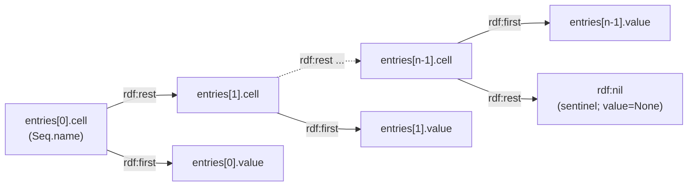

# RDFLib Reasoning Axioms

Agentic AI should be able to interface with formal logic.

Some formal logics (i.e., OWL 2) have a mapping from their axioms to RDF triples.
Unfortunately, one needs to refer to [OWL 2 Web Ontology Language Mapping to RDF Graphs (Second Edition)](https://www.w3.org/TR/2012/REC-owl2-mapping-to-rdf-20121211/) if they want to extract axioms while working with RDFLib.
In my opinion, models should not be constrained to operate at the triple-level when using ontological data.
The `rdflib-reasoning-axioms` package facilitates axiom-based graph traversals for Large Language Models (LLMs), Graph Neural Networks (GNNs), and other ML approaches.

The `rdflib-reasoning-axioms` package is part of the `rdflib-reasoning` metapackage.

## Feature Matrix

Status values:

- `Implemented`: available in the package today
- `Not started`: identified feature target with no concrete structural element implementation yet

The authoritative reference for this matrix is the local cached specification index at [`docs/specs/owl2-mapping-to-rdf/INDEX.md`](../docs/specs/owl2-mapping-to-rdf/INDEX.md).

### Core infrastructure

| Feature | Spec reference | Status | Notes |
| --- | --- | --- | --- |
| `GraphBacked` base model | package base infrastructure | Implemented | Common graph-scoped base for Pydantic models |
| `StructuralElement` base model | package base infrastructure | Implemented | Abstract OWL 2 structural element (axiom head) base with `name`, `as_triples`, and `as_quads`; enforces shared `context` for owned `StructuralFragment` fields |
| `StructuralFragment` base model | package base infrastructure | Implemented | Abstract base for owned scaffolding co-essential to a single `StructuralElement`'s RDF mapping; shares the owner's `context` |
| `SEQ` / RDF list helper | `SEQ` | Implemented | `Seq` (a `StructuralFragment`) plus `SeqEntry`: RDF list scaffolding with node-level `rdf:first` members |
| Facet list helper | (extension; supports `DatatypeRestriction`) | Implemented | `FacetList` (a `StructuralFragment`) plus `FacetEntry`: per-row `(cell, anchor, facet, value)` carrying both the cons-cell chain and the per-facet anchor triple |
| `axiomatize` graph traversal | RDF graph to structural elements | Implemented | Strict graph lifting for current datatype structural elements; unsupported or unclaimed triples fail the whole traversal |

#### Seq layout

`Seq` exposes its RDF cons-cell chain as a flat `entries: Sequence[SeqEntry]`; each `SeqEntry` pairs the cell node with its `rdf:first` value. The terminal sentinel row uses `cell == rdf:nil` and `value is None` and emits no `rdf:first` triple.

### Ontology header and declarations

| Feature | Spec reference | Status | Notes |
| --- | --- | --- | --- |
| Ontology header | `Ontology`, `imports`, `version` | Not started | |
| Datatype declaration | `DeclarationDatatype` | Implemented | `axiomatize` constructs this fallback for remaining `(DT, rdf:type, rdfs:Datatype)` triples not consumed by richer datatype patterns |
| Class declaration | `DeclarationClass` | Implemented | `axiomatize` constructs this fallback for remaining `(C, rdf:type, owl:Class)` triples |
| Object property declaration | `DeclarationObjectProperty` | Not started | |
| Data property declaration | `DeclarationDataProperty` | Not started | |
| Annotation property declaration | `DeclarationAnnotationProperty` | Not started | |
| Named individual declaration | `NamedIndividual` | Not started | |

### Data ranges and class expressions

| Feature | Spec reference | Status | Notes |
| --- | --- | --- | --- |
| Object inverse | `ObjectInverseOf` | Not started | |
| Data intersection | `DataIntersectionOf` | Implemented | Owned `Seq` operand list (n >= 2) |
| Data union | `DataUnionOf` | Implemented | Owned `Seq` operand list (n >= 2) |
| Data complement | `DataComplementOf` | Implemented | Cross-axiom operand via `N3Resource` node reference |
| Data enumeration | `DataOneOf` | Implemented | Owned `Seq` operand list of literals (n >= 1) |
| Datatype restriction | `DatatypeRestriction` | Implemented | Owned `FacetList` carrying per-facet anchor, predicate, and value |
| Object intersection | `ObjectIntersectionOf` | Not started | |
| Object union | `ObjectUnionOf` | Not started | |
| Object complement | `ObjectComplementOf` | Not started | |
| Object enumeration | `ObjectOneOf` | Not started | |
| Object existential restriction | `ObjectSomeValuesFrom` | Not started | |
| Object universal restriction | `ObjectAllValuesFrom` | Not started | |
| Object value restriction | `ObjectHasValue` | Not started | |
| Object self restriction | `ObjectHasSelf` | Not started | |
| Object min cardinality | `ObjectMinCardinality`, `ObjectMinCardinalityQualified` | Not started | |
| Object max cardinality | `ObjectMaxCardinality`, `ObjectMaxCardinalityQualified` | Not started | |
| Object exact cardinality | `ObjectExactCardinality`, `ObjectExactCardinalityQualified` | Not started | |
| Data existential restriction | `DataSomeValuesFrom`, `DataSomeValuesFromNary` | Implemented | Both unary and n-ary (n >= 2) forms |
| Data universal restriction | `DataAllValuesFromNary` | Implemented | N-ary form only (n >= 2); unary `DataAllValuesFrom` not started |
| Data value restriction | `DataHasValue` | Not started | |
| Data min cardinality | `DataMinCardinality`, `DataMinCardinalityQualified` | Not started | |
| Data max cardinality | `DataMaxCardinality`, `DataMaxCardinalityQualified` | Not started | |
| Data exact cardinality | `DataExactCardinality`, `DataExactCardinalityQualified` | Not started | |

#### Graph traversal coverage

`axiomatize(graph)` lifts supported RDF graph content into a deterministic
`tuple[StructuralElement, ...]`. The current traversal coverage follows the
implemented datatype and class structural elements above:
`DeclarationDatatype`, `DeclarationClass`, `DataIntersectionOf`,
`DataUnionOf`, `DataComplementOf`, `DataOneOf`, `DatatypeRestriction`,
`DataSomeValuesFrom`, `DataSomeValuesFromNary`, `DataAllValuesFromNary`, and
`SubClassOf`.

Traversal is strict in this baseline. If any input triple cannot be claimed by a
currently supported pattern, `axiomatize` raises `UnsupportedGraphError`
instead of returning a partial structural view. If a recognized pattern is
present but malformed, such as a broken RDF list or invalid facet list,
`axiomatize` raises `MalformedGraphError`.

### Class axioms

| Feature | Spec reference | Status |
| --- | --- | --- |
| Subclass axiom | `SubClassOf` | Implemented |
| Equivalent classes | `EquivalentClasses` | Not started |
| Disjoint classes | `DisjointClasses`, `DisjointClassesNary` | Not started |
| Disjoint union | `DisjointUnion` | Not started |

### Object property axioms

| Feature | Spec reference | Status |
| --- | --- | --- |
| Subobject property axiom | `SubObjectPropertyOf`, `SubObjectPropertyOfChain` | Not started |
| Equivalent object properties | `EquivalentObjectProperties` | Not started |
| Disjoint object properties | `DisjointObjectProperties`, `DisjointObjectPropertiesNary` | Not started |
| Object property domain | `ObjectPropertyDomain` | Not started |
| Object property range | `ObjectPropertyRange` | Not started |
| Inverse object properties | `InverseObjectProperties` | Not started |
| Functional object property | `FunctionalObjectProperty` | Not started |
| Inverse-functional object property | `InverseFunctionalObjectProperty` | Not started |
| Reflexive object property | `ReflexiveObjectProperty` | Not started |
| Irreflexive object property | `IrreflexiveObjectProperty` | Not started |
| Symmetric object property | `SymmetricObjectProperty` | Not started |
| Asymmetric object property | `AsymmetricObjectProperty` | Not started |
| Transitive object property | `TransitiveObjectProperty` | Not started |

### Data property axioms

| Feature | Spec reference | Status |
| --- | --- | --- |
| Subdata property axiom | `SubDataPropertyOf` | Not started |
| Equivalent data properties | `EquivalentDataProperties` | Not started |
| Disjoint data properties | `DisjointDataProperties`, `DisjointDataPropertiesNary` | Not started |
| Data property domain | `DataPropertyDomain` | Not started |
| Data property range | `DataPropertyRange` | Not started |
| Functional data property | `FunctionalDataProperty` | Not started |
| Datatype definition | `DatatypeDefinition` | Not started |

### Keys, assertions, and annotations

| Feature | Spec reference | Status |
| --- | --- | --- |
| Has-key axiom | `HasKey` | Not started |
| Same individual | `SameIndividual` | Not started |
| Different individuals | `DifferentIndividuals`, `DifferentIndividualsNary` | Not started |
| Class assertion | `ClassAssertion` | Not started |
| Object property assertion | `ObjectPropertyAssertion`, `ObjectPropertyAssertionInverseOf` | Not started |
| Negative object property assertion | `NegativeObjectPropertyAssertion` | Not started |
| Data property assertion | `DataPropertyAssertion` | Not started |
| Negative data property assertion | `NegativeDataPropertyAssertion` | Not started |
| Annotation assertion | `AnnotationAssertion` | Not started |
| Subannotation property axiom | `SubAnnotationPropertyOf` | Not started |
| Annotation property domain | `AnnotationPropertyDomain` | Not started |
| Annotation property range | `AnnotationPropertyRange` | Not started |
| Annotation value | `Annotation`, `AnnotationWithAnnotation` | Not started |
| Annotated axioms | `AxiomAnnotationMainTriple`, `AxiomAnnotationMultipleTriple`, `AxiomAnnotationBlankNode` | Not started |
